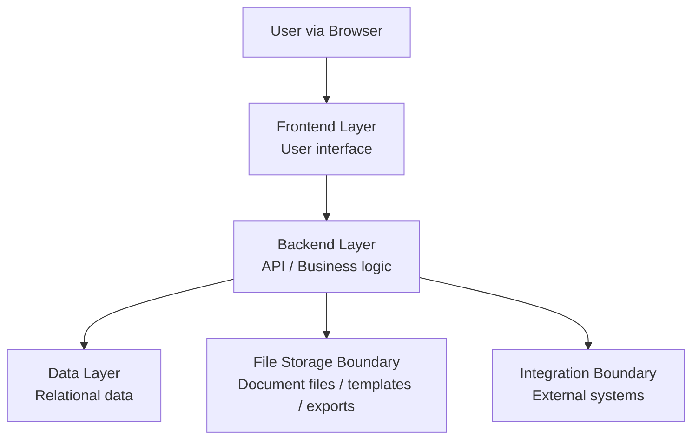

# Architecture

หน้านี้อธิบายโครงสร้างของ MatterSolv ด้วยภาษาที่อ่านตามได้:
หน้าจอคุยกับระบบหลังบ้านอย่างไร ข้อมูลถูกเก็บตรงไหน ข้อมูลของแต่ละองค์กร
แยกกันอย่างไร และจุดเชื่อมระบบภายนอกอยู่ตรงไหน

รายละเอียดผลิตภัณฑ์และบริการที่เลือกใช้หรือยังรอตัดสินใจอยู่ใน
[Technology Stack](/docs/architecture/technology-stack)

Architecture ปัจจุบันยึดแนวคิด web-based, matter-centered และ multi-tenant
โดยให้ Matter (แฟ้มงานกฎหมาย) เป็นศูนย์กลาง และแยกหน้าที่ระหว่าง frontend,
backend และ database ให้ชัดเจน แต่ยังทำงานบนภาษากลางชุดเดียวกัน

## Architecture Goals

- ทำให้ข้อมูลลูกความ แฟ้มงานกฎหมาย เอกสาร งานย่อย นัดหมาย เวลาทำงาน ใบเสนอราคา
  การวางบิล ข้อมูลตั้งต้นด้านการเงิน และข้อมูลบุคลากร
  เชื่อมกันจากข้อมูลหลักชุดเดียว
- รองรับหลาย tenant โดยข้อมูลของแต่ละองค์กรต้องไม่ปนกัน
- กำหนดว่าใครดูหรือแก้ไขข้อมูลใดได้ ผ่าน role, permission และ audit log
- ต่อเติม module ใหม่ได้ โดยไม่ทำให้ขั้นตอนหลักของแฟ้มงานกฎหมายซับซ้อนเกินไป
- เตรียมจุดเชื่อมระบบภายนอกไว้ล่วงหน้า โดยยังไม่ผูกกับผู้ให้บริการรายใดรายหนึ่ง
  ในรอบเริ่มต้น

## System Context

ผู้ใช้หลักของระบบทำงานผ่าน browser โดยเข้าสู่ MatterSolv เพื่อจัดการงาน
ประจำวันของสำนักงานกฎหมายหรือทีมกฎหมาย ระบบควรทำหน้าที่เป็นศูนย์กลางข้อมูล
ระหว่างทีมกฎหมาย ทีมปฏิบัติการ ผู้ดูแลระบบ และทีมการเงิน

- **Legal Users**: ทีมกฎหมายที่ใช้งานแฟ้มงานกฎหมาย งานย่อย เอกสาร นัดหมาย
  และใบเสนอราคา
- **Finance Users**: ทีมการเงินที่ติดตามการวางบิล การรับชำระเงิน
  และข้อมูลการเงินที่เกี่ยวข้อง
- **HR Users**: ทีม HR ที่ดูแลข้อมูลบุคลากร เงินเดือน และการลา
- **Administrators**: ผู้ดูแลระบบที่จัดการองค์กรผู้ใช้งาน ผู้ใช้งาน บทบาท สิทธิ์
  ข้อมูลตั้งต้น และค่าตั้งต้นของระบบ
- **External Systems**: ระบบภายนอกที่อาจเชื่อมต่อในอนาคต เช่น payment gateway,
  accounting system, e-Filing หรือ court system (ไม่รวม document signing service
  ซึ่งเป็นความสามารถที่อยู่ใน scope รอบเริ่มต้นแล้ว ดู Integration Strategy
  ด้านล่าง)

## Application Layers

- **Frontend Layer**: แสดงหน้าจอ รับข้อมูลจากผู้ใช้ และส่งคำสั่งไปยัง Backend
- **Backend Layer**: รับคำสั่งจากหน้าจอ ตรวจสิทธิ์ ตรวจความถูกต้องของข้อมูล
  จัดการขั้นตอนการทำงาน และส่งผลกลับไปยังหน้าจอ
- **Data Layer**: จัดเก็บข้อมูลหลักของระบบ เช่น องค์กรผู้ใช้งาน ผู้ใช้งาน
  ลูกความ แฟ้มงานกฎหมาย เอกสาร งานย่อย นัดหมาย เวลาทำงาน ใบเสนอราคา ใบแจ้งหนี้
  การรับชำระเงิน และข้อมูลบุคลากร/เงินเดือน
- **File Storage Boundary**: พื้นที่จัดเก็บไฟล์เอกสาร แม่แบบ และไฟล์ที่ส่งออก
  โดยเก็บข้อมูลกำกับไฟล์และสิทธิ์การเข้าถึงไว้ใน Data Layer
- **Integration Boundary**: จุดเชื่อมกับระบบอื่นควรถูกแยกชัดเจน เพื่อให้เปลี่ยน
  ผู้ให้บริการหรือเลื่อนไป phase ถัดไปได้

## Core Backend Components

- **Tenant Management**: จัดการข้อมูลองค์กร ขั้นตอนสมัครใช้งานของสำนักงานใหม่
  (self-service signup) การสร้าง BU Account พร้อม domain/sub-domain
  แพ็กเกจการใช้งาน (package/subscription tier) ที่ควบคุมโมดูลและจำนวน user
  สูงสุดต่อองค์กร และค่าตั้งต้นอื่นที่ทำให้ข้อมูลของแต่ละองค์กรแยกจากกัน
- **Identity and Access Control**: จัดการผู้ใช้งาน บทบาท สิทธิ์ และกติกาว่าใคร
  เห็นหรือแก้ไขข้อมูลใดได้บ้าง
- **Matter Workspace**: ส่วนกลางที่เชื่อมลูกความ เอกสาร งานย่อย นัดหมาย
  ใบเสนอราคา การวางบิล และข้อมูลการเงินเข้ากับแฟ้มงานกฎหมาย
- **Document Service**: ดูแลแม่แบบเอกสาร เอกสารที่ระบบสร้าง ไฟล์ที่อัปโหลด
  เวอร์ชัน การอนุมัติ และประวัติการเปลี่ยนแปลงของเอกสาร
- **Quotation and Billing Service**: จัดการรูปแบบค่าบริการ ใบเสนอราคา การอนุมัติ
  การแก้ไข ใบแจ้งหนี้ เงื่อนไขชำระ และสถานะการรับเงิน
- **Task and Scheduling Service**: จัดการการมอบหมายงาน กำหนดส่งงาน นัดหมาย
  และการแจ้งเตือนที่ผูกกับแฟ้มงานกฎหมายหรือผู้รับผิดชอบ
- **Time Tracking Service**: บันทึกเวลาทำงานของทนายทั้งแบบจับเวลาและบันทึก
  ย้อนหลัง จัดการขั้นตอนอนุมัติ และส่งต่อข้อมูลเวลาให้ Quotation and Billing
  Service ใช้คำนวณค่าบริการ
- **Finance Foundation Service**: จัดเตรียมข้อมูลสำหรับรายการรับเงิน
  รายการจ่ายเงิน ใบแจ้งหนี้ การรับชำระเงิน ข้อมูลภาษี และรายงานการเงินเบื้องต้น
- **Human Resource Service**: จัดการข้อมูลบุคลากร คำนวณเงินเดือน (Payroll)
  และระบบลา (Leave Management)
- **Audit and Reporting Service**: บันทึกการเปลี่ยนแปลงสำคัญ และเตรียมข้อมูล
  รายงาน/dashboard ให้ทุกโมดูล เช่น คดี ลูกค้า เวลาทำงาน งาน ใบเสนอราคา
  และการเงิน

## Matter-Centered Model

Matter เป็นข้อมูลหลักของงานหนึ่งเรื่อง ผู้ใช้ควรเริ่มจากแฟ้มงานกฎหมาย
แล้วเข้าถึงข้อมูลที่เกี่ยวข้องได้ครบถ้วน เช่น ลูกความ ประวัติการติดต่อ เอกสาร
งานย่อย นัดหมาย ใบเสนอราคา ใบแจ้งหนี้ การรับชำระเงิน และข้อมูลผลการทำงาน

ความสัมพันธ์หลักที่ควรใช้เป็นฐานสำหรับ database และ API มีดังนี้:

- หนึ่งองค์กรผู้ใช้งานมีผู้ใช้งาน ลูกความ แฟ้มงานกฎหมาย และข้อมูลตั้งต้นได้หลาย
  รายการ
- หนึ่งลูกความมีได้หลายแฟ้มงานกฎหมาย
- หนึ่งแฟ้มงานกฎหมายเชื่อมกับเอกสาร งานย่อย นัดหมาย ใบเสนอราคา ใบแจ้งหนี้
  และการรับชำระเงินได้หลายรายการ
- หนึ่งผู้ใช้งานอาจมีบทบาทต่างกันตามองค์กรหรือหน้าที่ในแฟ้มงานกฎหมาย
- ทุกข้อมูลสำคัญควรบอกได้ว่าเป็นขององค์กรใด และมีประวัติการเปลี่ยนแปลงที่ชัดเจน

## Multi-Tenant Boundary

ทุกข้อมูลหลักต้องระบุว่าเป็นของ tenant ใด เพื่อป้องกันไม่ให้ผู้ใช้ขององค์กรหนึ่ง
เห็นหรือแก้ไขข้อมูลของอีกองค์กรหนึ่งโดยไม่ตั้งใจ การออกแบบ API, query และ
permission check ต้องถือว่าการแยกข้อมูลองค์กรเป็นเงื่อนไขพื้นฐานเสมอ

แนวทางรอบเริ่มต้น:

- ทุก request ต้องรู้ว่าอยู่ในองค์กรใด
- การดึงข้อมูลธุรกิจต้องกรองตามองค์กรผู้ใช้งานเสมอ
- การตรวจสิทธิ์ต้องดูทั้งบทบาทระดับระบบและสิทธิ์ที่เกี่ยวข้องกับแฟ้มงานกฎหมาย
- audit log ต้องบันทึกว่าใครทำอะไร กับข้อมูลใด ในองค์กรใด และทำเมื่อไร

## Tenant Onboarding & Package Management

MatterSolv เป็นระบบแบบ multi-tenant SaaS ที่รองรับหลายสำนักงานกฎหมาย
(หลายบริษัท) ใช้งานระบบเดียวกัน แต่ละสำนักงานคือหนึ่ง tenant ที่แยกข้อมูลกัน
เด็ดขาด ภายในหนึ่ง tenant กำหนดทีมงาน บทบาท และผู้รับผิดชอบของตนเองได้ตาม
[Roles](/docs/roles)

แนวทางรอบเริ่มต้น:

- สำนักงานใหม่สมัครใช้งานผ่านขั้นตอน self-service signup หรือให้ platform
  onboarding service ดำเนินการผ่าน controlled support identity แล้วระบบสร้าง BU
  Account พร้อม domain/sub-domain และ initial Tenant Admin membership
- แต่ละ tenant ผูกกับแพ็กเกจ (package) ที่กำหนดว่าเปิดใช้โมดูลใดได้บ้าง
  โดยระบบรองรับการจำกัดจำนวน user สูงสุดต่อ tenant (User Limit Control)
  เป็นกลไกของแพลตฟอร์ม
- แผนทั้งห้าที่ใช้อยู่ปัจจุบันตั้งค่า User Limit Control เป็นไม่จำกัดทุกแผน
  **การเชิญ user ใหม่จึงต้องไม่ถูกปฏิเสธด้วยเหตุผลเรื่องจำนวนสมาชิก**
  ดูค่าที่ใช้จริงได้ที่ [Feature Comparison](/docs/plans/feature-comparison)
- ระบบต้องตรวจสอบสิทธิ์ของแพ็กเกจก่อนเปิดใช้โมดูลเพิ่มเติม
- การเปลี่ยนแพ็กเกจ (upgrade/downgrade) ควรมีผลทันทีต่อสิทธิ์การเข้าถึงโมดูล
- ระบบเรียกเก็บเงินค่าสมัครใช้งานแพลตฟอร์ม (platform subscription billing)
  จากสำนักงานลูกค้ายังไม่อยู่ในขอบเขตรอบเริ่มต้น
  แยกจาก Quotation and Billing Service ที่แต่ละสำนักงานใช้เรียกเก็บเงินจาก
  ลูกความของตนเอง

## Security and Audit

ระบบควรวางแนวทางความปลอดภัยจากการกำหนดสิทธิ์ตามบทบาทเป็นพื้นฐาน
แล้วค่อยขยายด้วยสิทธิ์เฉพาะ module หรือสิทธิ์เฉพาะ Matter เมื่อขอบเขตการใช้งาน
ชัดเจนขึ้น

- จำกัดการเข้าถึงข้อมูลตามบทบาทและองค์กรผู้ใช้งาน
- แยกสิทธิ์สำหรับการดู เพิ่ม แก้ไข อนุมัติ ส่งออก และลบข้อมูล
- บันทึกประวัติการเปลี่ยนแปลงสำหรับข้อมูลสำคัญ
- ป้องกันการเข้าถึงเอกสารและไฟล์ที่ส่งออกโดยไม่ผ่านการตรวจสิทธิ์
- เตรียมแนวทาง backup และ recovery สำหรับฐานข้อมูลและไฟล์เอกสาร

## Integration Strategy

รอบเริ่มต้นควรออกแบบจุดเชื่อมระบบภายนอกไว้ก่อน แต่ยังไม่ถือว่าต้องเชื่อมต่อระบบ
production ทั้งหมดตั้งแต่ phase แรก

**อยู่ในขอบเขตรอบเริ่มต้น**: การลงนามอิเล็กทรอนิกส์ (e-signature) เป็นความ
สามารถที่อยู่ใน scope ของ Document Automation Management ตั้งแต่ต้น (ดู
[Scope](/docs/scope)) แต่ยังไม่ผูกกับผู้ให้บริการรายใดรายหนึ่ง —
ออกแบบเป็นจุดเชื่อม (integration boundary) ที่เปลี่ยนผู้ให้บริการได้ในภายหลัง

รอบเริ่มต้นรวม provider-neutral adapter, sandbox/stub และ internal
Task/Calendar/ notification workflow แต่การเชื่อม production provider ต้องผ่าน
discovery, security/consent contract และ release gate ก่อนเปิดใช้

ระบบภายนอกอื่นที่อาจต้องรองรับในอนาคต หรือยังไม่รวม production provider
onboarding ในรอบเริ่มต้น:

- payment gateway หรือ bank integration
- external accounting หรือ ERP system
- court, e-Filing หรือ government service
- production email, calendar หรือ notification provider onboarding

## Related Documents

- [Technology Stack](/docs/architecture/technology-stack)
- [Development Rules](/docs/development/rules)
- [Database](/docs/database)
- [API](/docs/api)
