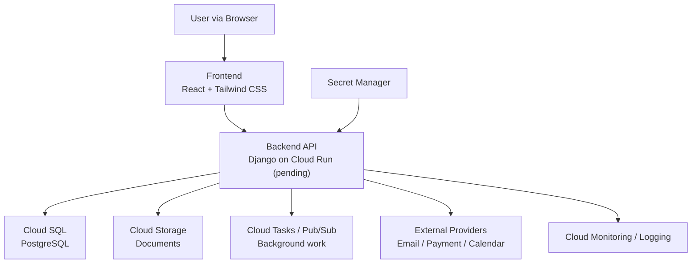

# Technology Stack

หน้านี้สรุปเทคโนโลยีของระบบ MatterSolv และบริการที่ต้องเลือกก่อนเปิดใช้งานจริง
ระบบใช้ Google Cloud Platform เป็น Cloud Platform หลัก

## System Overview

## Core Application

| ส่วนระบบ            | เทคโนโลยี                | หน้าที่                                                                          |
| :------------------ | :----------------------- | :------------------------------------------------------------------------------- |
| Frontend            | React และ Tailwind CSS   | สร้างหน้าจอสำหรับผู้ใช้งานผ่าน browser                                           |
| Backend             | Django                   | จัดการ API, business rules, permission และ workflow                              |
| Authentication      | Django Authentication    | จัดการบัญชี รหัสผ่าน session, group และ permission โดยไม่สร้างระบบยืนยันตัวตนเอง |
| Database            | Cloud SQL for PostgreSQL | จัดเก็บข้อมูลธุรกิจ ความสัมพันธ์ และ audit data                                  |
| Application Runtime | Cloud Run (รอยืนยัน)     | รัน Django และบริการที่บรรจุเป็น container โดยไม่ต้องดูแล cluster                |

## PostgreSQL Capabilities

| ความสามารถ               | การใช้งานใน MatterSolv                                                                                          |
| :----------------------- | :--------------------------------------------------------------------------------------------- |
| Row-Level Security       | บังคับขอบเขตข้อมูลตาม Workspace เป็นชั้นป้องกันเพิ่มเติมจาก Django permission และ query filter |
| Declarative Partitioning | แบ่งเฉพาะตารางขนาดใหญ่ตามช่วงเวลาเมื่อมีผลวัดรองรับ ไม่สร้าง partition แยกตาม Workspace        |

รายละเอียด policy, database role, partition candidate และ test อยู่ใน
[Database](/docs/database)

## Google Cloud Services

| ความต้องการ         | บริการที่วางแผนใช้                                  | แนวทาง                                                                        |
| :------------------ | :-------------------------------------------------- | :---------------------------------------------------------------------------- |
| Document Storage    | Cloud Storage                                       | เก็บเอกสาร แม่แบบ และไฟล์ส่งออก โดยเก็บ metadata กับ permission ใน PostgreSQL |
| Container Registry  | Artifact Registry                                   | เก็บ container image ที่ผ่านขั้นตอน build และตรวจสอบแล้ว                      |
| Secrets             | Secret Manager                                      | เก็บ database credential, API key และ secret โดยไม่บันทึกใน source code       |
| Monitoring          | Cloud Monitoring, Cloud Logging และ Error Reporting | ตรวจ availability, error, latency, resource usage และเหตุการณ์สำคัญ           |
| Background Jobs     | Cloud Tasks และ Cloud Scheduler                     | ทำงานเบื้องหลัง งานตามเวลา retry และงานที่ไม่ควรรอใน HTTP request             |
| Event Distribution  | Pub/Sub เมื่อมีหลาย consumer                        | ส่ง event ระหว่างบริการโดยไม่ผูกผู้ส่งกับผู้รับโดยตรง                         |
| Cache               | Memorystore for Redis เมื่อผลวัดแสดงว่าจำเป็น       | ลดงานซ้ำและเก็บข้อมูลชั่วคราว ห้ามใช้แทนฐานข้อมูลหลัก                         |
| Network Edge        | Cloud Load Balancing และ Cloud Armor                | จัดการ HTTPS, WAF และการป้องกัน request ที่ผิดปกติ                            |
| DNS                 | Cloud DNS                                           | จัดการ domain และ DNS record ของระบบ                                          |
| Backup and Recovery | Cloud SQL backup/PITR และ Cloud Storage lifecycle   | กู้คืนฐานข้อมูลและไฟล์ตามระยะเวลาที่กำหนดและผ่าน restore test                 |

## Services to Select

บริการต่อไปนี้จำเป็นต่อระบบ แต่ต้องประเมิน provider, ค่าใช้จ่าย, security, data
location และการรองรับประเทศไทยก่อนเลือกใช้จริง

| ความต้องการ              | แนวทางเริ่มต้น                               | สิ่งที่ต้องยืนยัน                                                                |
| :----------------------- | :------------------------------------------- | :------------------------------------------------------------------------------- |
| Transactional Email      | ใช้ email provider ผ่าน adapter กลาง         | Delivery status, bounce, suppression, domain verification และ data location      |
| Subscription Payment     | ใช้ payment gateway ที่รองรับบัตรและ webhook | สกุลเงินบาท ภาษี refund, recurring payment, webhook security และ reconciliation  |
| Calendar and Messaging   | เชื่อม provider ผ่าน API/adapter             | Consent, token lifecycle, retry, audit และขอบเขตข้อมูล                           |
| Product Search           | เริ่มจาก PostgreSQL search                   | ประเมิน search service เพิ่มเมื่อปริมาณข้อมูลหรือรูปแบบการค้นหาเกินขีดความสามารถ |
| Customer Support Channel | เริ่มจากช่องทาง support ที่ควบคุมได้         | Ticket ownership, SLA, access scope และ retention                                |

## Delivery and Security

**GitHub → GitHub Actions → Artifact Registry → Development / Staging /
Production**

- ใช้ GitHub Actions สำหรับ test และ deployment โดยไม่เก็บ long-lived cloud key
  ใน repository
- แยก environment และ Google Cloud project ของ development, staging และ
  production
- ให้แต่ละ service account มีสิทธิ์เท่าที่จำเป็นต่อหน้าที่
- เชื่อม Cloud SQL และบริการภายในผ่านช่องทางที่จำกัดการเข้าถึง
- เปิด TLS, rate limiting, audit logging, backup และ monitoring ก่อน production
- ใช้ provider-neutral adapter กับบริการภายนอก เพื่อให้เปลี่ยน provider
  ได้โดยไม่กระทบ business logic

## Not Required Initially

- Kubernetes/GKE จนกว่าจะมีข้อกำหนดที่ Cloud Run รองรับไม่ได้
- External search engine จนกว่าจะมีผลวัดจาก PostgreSQL search
- AI provider จนกว่าจะมี use case, data policy และ approval ที่ชัดเจน
- Marketing automation และ marketing analytics ไม่ใช่ส่วนของระบบ MatterSolv

## Related Documents

- [Architecture](/docs/architecture)
- [Development Workflow](/docs/development/workflow)
- [Scalability & Capacity](/docs/architecture/scalability-capacity)
- [Development Rules](/docs/development/rules)
- [Database](/docs/database)
- [API](/docs/api)
