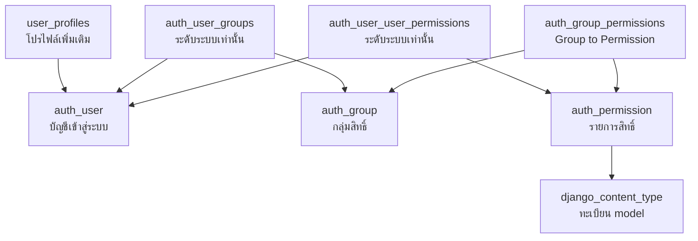
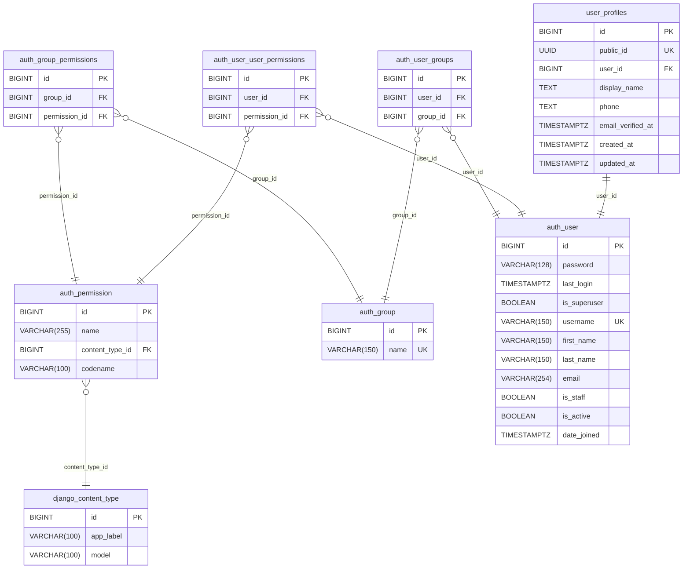
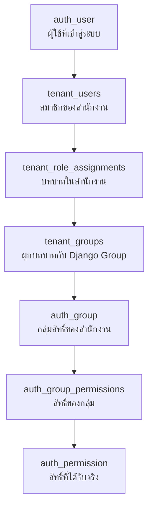

# Django Authentication Tables

หน้านี้อธิบายตารางใน subject area Django Authentication ของ diagram ฐานข้อมูล
เป็นรายตาราง ว่าแต่ละตารางเก็บอะไร คอลัมน์สำคัญมีความหมายอย่างไร และมีข้อจำกัด
ใดบ้าง รวมทั้งหมด 8 ตาราง โดย 7 ตารางเป็นของ Django framework ที่สร้างและดูแล
ด้วย Django migrations ส่วน user_profiles เป็นตารางที่ MatterSolv สร้างเอง
เพื่อขยายข้อมูลผู้ใช้

กฎการใช้งานและ contract ระดับระบบอยู่ที่ [Database](/docs/database) ส่วนความหมาย
เชิงธุรกิจของบทบาทและรหัสสิทธิ์อยู่ที่ [Roles](/docs/roles) และ
[Permissions](/docs/roles/permissions)

ตารางฝั่งสำนักงานที่ทำให้บทบาทแยกตาม Tenant ได้แก่ tenant_users, tenant_groups
และ tenant_role_assignments ไม่อยู่ในขอบเขตของหน้านี้ แต่เส้นทางการตรวจสิทธิ์
ที่เชื่อมสองฝั่งเข้าด้วยกันอธิบายไว้ที่หัวข้อ Permission Resolution Path

## Table Catalogue

| ตาราง | เจ้าของ | หน้าที่ |
| --- | :---: | --- |
| auth_user | Django | บัญชีเข้าสู่ระบบกลาง หนึ่งคนมีหนึ่งแถวทั้งระบบ |
| user_profiles | MatterSolv | ข้อมูลโปรไฟล์ที่ขยายจาก auth_user แบบ one-to-one |
| auth_group | Django | กลุ่มสิทธิ์ที่ใช้เป็นบทบาทของสำนักงานผ่านตารางเชื่อม |
| auth_permission | Django | รายการสิทธิ์ทั้งหมดที่ประกาศบน Django model |
| django_content_type | Django | ทะเบียน model ที่ระบุว่า permission เป็นของ model ใด |
| auth_group_permissions | Django | ตารางเชื่อม Group กับ Permission |
| auth_user_groups | Django | ตารางเชื่อม User กับ Group ระดับระบบเท่านั้น |
| auth_user_user_permissions | Django | ตารางเชื่อม User กับ Permission ระดับระบบเท่านั้น |

ลูกศรในแผนภาพชี้จากตารางที่ถือ Foreign Key ไปยังตารางปลายทาง

แผนภาพถัดไปเป็น Entity Relationship Diagram ของ subject area เดียวกัน แสดงคอลัมน์
ทั้งหมดของแต่ละตารางพร้อมชนิดข้อมูลและความยาว โดยชนิดข้อมูลตรงกับที่ประกาศไว้ใน
database.ddb ซึ่งเป็น source of truth ของ schema

user_profiles ผูกกับ auth_user แบบ one-to-one เพราะ user_id เป็น UNIQUE ส่วน
ความสัมพันธ์อื่นเป็น one-to-many ทั้งหมด

## auth_user

บัญชีเข้าสู่ระบบมาตรฐานของ Django หนึ่งคนมีหนึ่งแถวในระบบทั้งหมด ไม่ว่าจะเป็น
สมาชิกกี่สำนักงาน ตารางนี้ไม่มี tenant_id และไม่เปิด Row-Level Security เพราะ
เป็นข้อมูลกลางระดับระบบ การผูกกับสำนักงานเกิดที่ tenant_users

| คอลัมน์ | ชนิด | คำอธิบาย |
| --- | --- | --- |
| id | BIGINT | Primary Key แบบ identity ตาม Django migrations ไม่มี public_id |
| password | VARCHAR(128) | รหัสผ่านที่ผ่าน hash ของ Django |
| last_login | TIMESTAMPTZ | เวลาเข้าสู่ระบบครั้งล่าสุด |
| is_superuser | BOOLEAN | สิทธิ์ผู้ดูแลระบบ MatterSolv ค่าเริ่มต้น false |
| username | VARCHAR(150) | ชื่อผู้ใช้ UNIQUE ทั้งระบบ เก็บ Login Email |
| first_name | VARCHAR(150) | ชื่อตามข้อมูล Django |
| last_name | VARCHAR(150) | นามสกุลตามข้อมูล Django |
| email | VARCHAR(254) | อีเมล ต้องมีค่าเท่ากับ username เสมอ |
| is_staff | BOOLEAN | สิทธิ์เข้า Django Admin ค่าเริ่มต้น false |
| is_active | BOOLEAN | สถานะใช้งานระดับระบบ ค่าเริ่มต้น true |
| date_joined | TIMESTAMPTZ | เวลาสร้างบัญชี ค่าเริ่มต้น now() |

ข้อจำกัดที่บังคับในฐานข้อมูล:

- username มี CHECK (username = lower(btrim(username))) เพื่อให้ Login Email
  ถูก normalize ก่อนบันทึกเสมอ
- email มี CHECK (email = username) เพื่อให้เข้าสู่ระบบด้วยอีเมลผ่าน ModelBackend
  มาตรฐานโดยไม่ต้องสร้าง Custom User หรือ Authentication Backend
- username เป็น UNIQUE ทั้งระบบ จึงทำให้ Login Email ไม่ซ้ำกันโดยปริยาย

is_active กับ tenant_users.status ทำหน้าที่ต่างกัน is_active เป็น false ระงับ
การเข้าสู่ระบบทั้งระบบ ส่วน tenant_users.status ระงับเฉพาะสำนักงานเดียว
โดยผู้ใช้ยังเข้าสำนักงานอื่นได้ตามปกติ

is_superuser และ is_staff เป็นสิทธิ์ของทีมงาน MatterSolv เอง ไม่ใช่บทบาทของ
สำนักงานลูกค้า และห้ามนำมาใช้แทนบทบาทระดับ Tenant

## user_profiles

ข้อมูลโปรไฟล์ที่ MatterSolv ขยายจาก Default Django User โดย credentials และ
สถานะเปิดใช้งานระดับระบบยังคงอยู่ใน auth_user ตารางนี้ผูกแบบ one-to-one และ
ไม่มี tenant_id เพราะเป็นข้อมูลของตัวบุคคล ไม่ใช่ของสำนักงาน

| คอลัมน์ | ชนิด | คำอธิบาย |
| --- | --- | --- |
| id | BIGINT | Primary Key ภายใน ห้ามเปิดเผยผ่าน API |
| public_id | UUID | Identifier ที่เปิดผ่าน API ค่าเริ่มต้น uuidv7() |
| user_id | BIGINT | Foreign Key ไป auth_user.id เป็น UNIQUE จึงเป็น one-to-one |
| display_name | TEXT | ชื่อที่แสดงในหน้าจอและประวัติการทำงาน |
| phone | TEXT | หมายเลขโทรศัพท์ |
| email_verified_at | TIMESTAMPTZ | เวลายืนยันอีเมล ถ้ายังไม่ยืนยันเป็น NULL |
| created_at | TIMESTAMPTZ | เวลาสร้างระเบียน ค่าเริ่มต้น now() |
| updated_at | TIMESTAMPTZ | เวลาแก้ไขล่าสุด ค่าเริ่มต้น now() |

user_profiles เป็นตารางเดียวใน subject area นี้ที่ MatterSolv เป็นเจ้าของ จึง
ใช้ hybrid identifier ตามมาตรฐานของระบบ คือ id แบบ BIGINT สำหรับ join ภายใน
และ public_id แบบ UUID v7 สำหรับ API ต่างจากตาราง Django ที่คงเฉพาะ BIGINT

## auth_group

กลุ่มสิทธิ์มาตรฐานของ Django มีเพียงสองคอลัมน์ MatterSolv ใช้หนึ่ง Group แทน
หนึ่งบทบาทของหนึ่งสำนักงาน โดย provisioning สร้าง Group แยกต่อ tenant สำหรับ
role code owner, administrator และ member

| คอลัมน์ | ชนิด | คำอธิบาย |
| --- | --- | --- |
| id | BIGINT | Primary Key ตาม Django migrations |
| name | VARCHAR(150) | ชื่อกลุ่ม UNIQUE ทั้งระบบ ใช้เป็นชื่อภายในเท่านั้น |

เนื่องจาก name เป็น UNIQUE ทั้งระบบ สองสำนักงานจึงตั้งชื่อบทบาทซ้ำกันตรง ๆ
ไม่ได้ ระบบจึงตั้งชื่อภายในเป็นรูปแบบ tenant_uuid ตามด้วยเครื่องหมายทวิภาคและ
role_code เพื่อไม่ให้ชนกันข้ามสำนักงาน ผู้ใช้ไม่เคยเห็นค่านี้

ชื่อที่แสดงต่อผู้ใช้เก็บใน tenant_groups.display_name ส่วนรหัสบทบาทที่โค้ดใช้
อ้างอิงเก็บใน tenant_groups.code การเปลี่ยนชื่อที่ผู้ใช้เห็นจึงไม่กระทบ
auth_group.name

## auth_permission

บัญชีรายการสิทธิ์ทั้งหมดของระบบ ทั้ง model permission มาตรฐานของ Django และ
custom permission ที่ประกาศไว้ใน Meta.permissions

| คอลัมน์ | ชนิด | คำอธิบาย |
| --- | --- | --- |
| id | BIGINT | Primary Key ตาม Django migrations |
| name | VARCHAR(255) | คำอธิบายสิทธิ์ที่มนุษย์อ่านได้ |
| content_type_id | BIGINT | Foreign Key ไป django_content_type.id |
| codename | VARCHAR(100) | รหัสสิทธิ์ที่โค้ดใช้ตรวจ เช่น view_sensitive |

สิทธิ์ทุกรายการต้องประกาศบน Django model และสร้างโดย migration เท่านั้น ห้าม
สร้างหรือแก้ไขแถวในตารางนี้จาก runtime หรือจากหน้าจอผู้ดูแล เพราะจะทำให้
permission catalogue ไม่ตรงกับโค้ด

ดูรายการ codename ที่ระบบใช้จริงได้ที่ [Permissions](/docs/roles/permissions)

## django_content_type

ทะเบียน model ภายในของ Django ใช้ระบุว่าสิทธิ์แต่ละรายการเป็นของ model ใด
Django สร้างและดูแลตารางนี้อัตโนมัติ

| คอลัมน์ | ชนิด | คำอธิบาย |
| --- | --- | --- |
| id | BIGINT | Primary Key ตาม Django migrations |
| app_label | VARCHAR(100) | ชื่อ Django app ที่ model นั้นอยู่ |
| model | VARCHAR(100) | ชื่อ model แบบตัวพิมพ์เล็ก |

ตารางนี้ไม่มีข้อมูลธุรกิจ และไม่ต้องดูแลด้วยมือ แต่จำเป็นต้องมีเพราะ
auth_permission.content_type_id อ้างถึงตารางนี้

## auth_group_permissions

ตารางเชื่อมแบบ many-to-many ระหว่าง auth_group กับ auth_permission ตอบคำถาม
ว่าบทบาทหนึ่งมีสิทธิ์อะไรบ้าง

| คอลัมน์ | ชนิด | คำอธิบาย |
| --- | --- | --- |
| id | BIGINT | Primary Key ตาม Django migrations |
| group_id | BIGINT | Foreign Key ไป auth_group.id |
| permission_id | BIGINT | Foreign Key ไป auth_permission.id |

ตารางนี้เป็นปลายทางของการตรวจสิทธิ์ระดับสำนักงาน โดยต้องเข้าถึงผ่าน
tenant_role_assignments และ tenant_groups เสมอ ไม่ใช่ผ่าน auth_user_groups

## auth_user_groups

ตารางเชื่อม User กับ Group ระดับระบบของ Django สงวนไว้สำหรับ Group ที่ไม่ขึ้นกับ
สำนักงาน เช่น กลุ่มของทีมงาน MatterSolv เอง

| คอลัมน์ | ชนิด | คำอธิบาย |
| --- | --- | --- |
| id | BIGINT | Primary Key ตาม Django migrations |
| user_id | BIGINT | Foreign Key ไป auth_user.id |
| group_id | BIGINT | Foreign Key ไป auth_group.id |

> **ห้าม:** ใช้ตารางนี้มอบบทบาทระดับสำนักงาน เพราะ Django รวมสิทธิ์จากทุก Group
> ของผู้ใช้เข้าด้วยกัน ผู้ใช้ที่เป็นสมาชิกหลายสำนักงานจะได้สิทธิ์ติดตัวข้าม
> สำนักงานทันที ให้มอบบทบาทผ่าน tenant_role_assignments แทน

## auth_user_user_permissions

ตารางเชื่อม User กับ Permission โดยตรงระดับระบบ ใช้มอบสิทธิ์เฉพาะรายที่ไม่ผ่าน
Group

| คอลัมน์ | ชนิด | คำอธิบาย |
| --- | --- | --- |
| id | BIGINT | Primary Key ตาม Django migrations |
| user_id | BIGINT | Foreign Key ไป auth_user.id |
| permission_id | BIGINT | Foreign Key ไป auth_permission.id |

> **ห้าม:** ใช้ตารางนี้มอบสิทธิ์ระดับสำนักงาน ด้วยเหตุผลเดียวกับ auth_user_groups
> คือสิทธิ์จะติดตัวผู้ใช้ข้ามทุกสำนักงาน

## Permission Resolution Path

ระบบมีเส้นทางตรวจสิทธิ์สองเส้นที่ต้องแยกจากกันอย่างเคร่งครัด

เส้นทางระดับสำนักงาน ใช้กับสิทธิ์ของบทบาทในแต่ละ Workspace ตรวจด้วยฟังก์ชัน
has_tenant_perm โดยรับ user, tenant และ permission แล้ว query ตามลำดับ
tenant_role_assignments ไป tenant_groups และไป auth_group_permissions

เส้นทางระดับระบบ ใช้กับสิทธิ์ที่ไม่ขึ้นกับสำนักงาน ตรวจด้วย user.has_perm
ตามมาตรฐาน Django ผ่าน auth_user_groups และ auth_user_user_permissions

> **ห้าม:** ใช้ user.has_perm ตัดสินสิทธิ์รายสำนักงาน เพราะ Django รวมสิทธิ์
> จากทุก Group ของผู้ใช้ ทำให้บทบาทของสำนักงานหนึ่งรั่วไปยังอีกสำนักงานหนึ่ง

data scope และเงื่อนไข workflow เป็นการตรวจเพิ่มเติมที่ authorization service
ต้องทำแยกจากการตรวจ permission

## Related Documents

- [Database](/docs/database) — หลักการออกแบบฐานข้อมูลและกฎการใช้ตาราง Django auth
- [Roles](/docs/roles) — ความหมายเชิงธุรกิจของบทบาทในสำนักงาน
- [Permissions](/docs/roles/permissions) — รหัสสิทธิ์และ Django permission contract
- [User Accounts](/docs/modules/administration/user-accounts) — การสร้างและเชิญผู้ใช้
- [Development Rules](/docs/development/rules) — กฎการใช้ Django Authentication ในโค้ด
