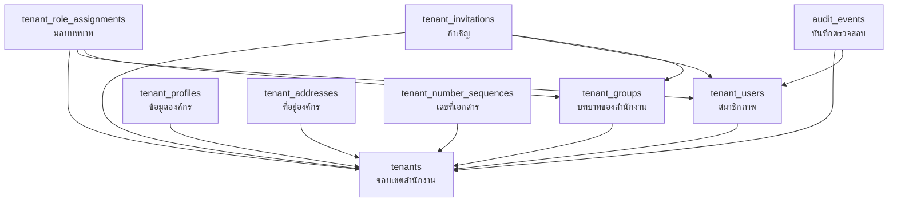
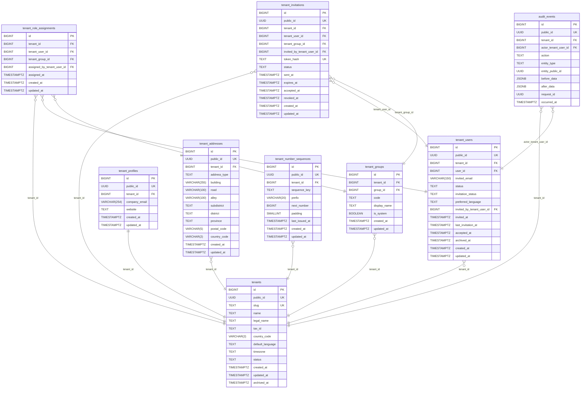

# Tenant & Authorization Tables

หน้านี้อธิบายตารางใน subject area Tenant & Authorization ของ diagram ฐานข้อมูล
เป็นรายตาราง ว่าแต่ละตารางเก็บอะไร คอลัมน์สำคัญมีความหมายอย่างไร และมีข้อจำกัด
ใดบ้าง รวมทั้งหมด 9 ตาราง ทุกตาราง MatterSolv เป็นเจ้าของเอง มีคอลัมน์ tenant_id
และเปิด Row-Level Security ทั้งหมด ต่างจากตารางฝั่ง identity ที่ Django เป็นเจ้าของ

ตารางกลุ่มนี้คือส่วนที่ทำให้ระบบเป็น multi-tenant จริง ทั้งการแยกข้อมูลของแต่ละ
สำนักงาน การเป็นสมาชิก การมอบบทบาท และการบันทึกร่องรอยการใช้งาน

กฎการใช้งานระดับระบบและ contract ของ RLS อยู่ที่ [Database](/docs/database)
ตารางฝั่งบัญชีผู้ใช้อยู่ที่
[Django Authentication Tables](/docs/database/django-auth) ส่วนความหมายเชิงธุรกิจ
ของบทบาทอยู่ที่ [Roles](/docs/roles) และ [Permissions](/docs/roles/permissions)

## Table Catalogue

| ตาราง | หน้าที่ |
| --- | --- |
| tenants | สำนักงานหนึ่งแห่งคือหนึ่งแถว เป็นขอบเขตแยกข้อมูลของทั้งระบบ |
| tenant_users | สมาชิกภาพ ผูกบัญชีผู้ใช้เข้ากับสำนักงาน รองรับการเชิญก่อนมีบัญชี |
| tenant_groups | ผูกบทบาทของสำนักงานเข้ากับ Django Group |
| tenant_role_assignments | มอบบทบาทให้สมาชิกภายในสำนักงานเดียวกัน |
| tenant_invitations | คำเชิญเข้าสำนักงาน พร้อมบทบาทที่จะได้รับเมื่อตอบรับ |
| tenant_profiles | ข้อมูลติดต่อขององค์กร แบบหนึ่งต่อหนึ่งกับ tenants |
| tenant_addresses | ที่อยู่ขององค์กร แยกตามประเภทที่อยู่ |
| tenant_number_sequences | ตัวออกเลขที่เอกสารของแต่ละสำนักงาน |
| audit_events | บันทึกตรวจสอบแบบเขียนแล้วแก้ไม่ได้ |

tenant_groups และ tenant_role_assignments เป็นตารางเชื่อมภายใน จึงไม่มี public_id
เพราะ client ไม่ได้อ้างถึงระเบียนเหล่านี้โดยตรง อีกเจ็ดตารางที่เหลือมี public_id
ครบตามมาตรฐาน hybrid identifier ของระบบ

ลูกศรในแผนภาพชี้จากตารางที่ถือ Foreign Key ไปยังตารางปลายทาง โดยแสดงเฉพาะ
ความสัมพันธ์ภายใน subject area นี้

แผนภาพถัดไปเป็น Entity Relationship Diagram ของ subject area เดียวกัน แสดงคอลัมน์
ทั้งหมดของแต่ละตารางพร้อมชนิดข้อมูลและความยาว โดยชนิดข้อมูลตรงกับที่ประกาศไว้ใน
database.ddb ซึ่งเป็น source of truth ของ schema

## Composite Tenant Foreign Keys

กฎที่ว่าห้ามมอบบทบาทของสำนักงาน ก. ให้สมาชิกของสำนักงาน ข. ไม่ได้อาศัยโค้ดฝั่งแอป
อย่างเดียว แต่บังคับที่ระดับฐานข้อมูลด้วย composite tenant foreign key

Foreign Key ปกติตรวจแค่ว่า ID ปลายทางมีอยู่จริงหรือไม่ ถ้าผู้โจมตีเดา ID ของ
สำนักงานอื่นได้ถูก การเชื่อมก็จะผ่าน แต่ composite key อ้างอิงเป็นคู่แทน คือ
tenant_id คู่กับ id ไปยัง tenant_id คู่กับ id ของตารางแม่ ทำให้แถวลูกกับแถวแม่
ต้องอยู่สำนักงานเดียวกันเสมอ ID ที่มีอยู่จริงแต่เป็นของอีกสำนักงานหนึ่งจึงใช้
ไม่ได้ ตารางแม่ทุกตัวจึงต้องมี unique index บน tenant_id คู่กับ id รองรับไว้

คู่ที่บังคับไว้ภายใน subject area นี้

- tenant_users.invited_by_tenant_user_id ชี้ไป tenant_users
- tenant_role_assignments.tenant_user_id ชี้ไป tenant_users
- tenant_role_assignments.tenant_group_id ชี้ไป tenant_groups
- tenant_role_assignments.assigned_by_tenant_user_id ชี้ไป tenant_users
- tenant_invitations.tenant_user_id ชี้ไป tenant_users
- tenant_invitations.tenant_group_id ชี้ไป tenant_groups
- tenant_invitations.invited_by_tenant_user_id ชี้ไป tenant_users
- audit_events.actor_tenant_user_id ชี้ไป tenant_users

Foreign Key ทุกเส้นที่ชี้ไป tenants ใช้ ON DELETE RESTRICT หรือ NO ACTION เสมอ
เพื่อปฏิเสธการลบสำนักงานที่ยังมีข้อมูลอ้างอิงอยู่ ดูกฎการหยุดใช้งานสำนักงานได้ที่
[Database](/docs/database)

## tenants

หนึ่งแถวคือหนึ่งสำนักงาน เป็นขอบเขตแยกข้อมูลของทั้งระบบ ค่า id ของตารางนี้คือค่า
ที่ backend นำไปตั้งเป็น RLS context ภายใน transaction

| คอลัมน์ | ชนิด | คำอธิบาย |
| --- | --- | --- |
| id | BIGINT | Primary Key ภายใน ใช้เป็นค่า RLS context |
| public_id | UUID | Identifier ที่เปิดผ่าน API ค่าเริ่มต้น uuidv7() |
| slug | TEXT | ชื่อย่อ UNIQUE ทั้งระบบ ต้องเป็นตัวพิมพ์เล็ก |
| name | TEXT | ชื่อสำนักงานที่ใช้แสดง |
| legal_name | TEXT | ชื่อตามกฎหมาย |
| tax_id | TEXT | เลขประจำตัวผู้เสียภาษี ไม่จำกัดความยาวโดยตั้งใจ |
| country_code | VARCHAR(2) | รหัสประเทศสองตัวอักษร |
| default_language | TEXT | ภาษาเริ่มต้น th หรือ en |
| timezone | TEXT | เขตเวลาของสำนักงาน ใช้คำนวณวันที่เชิงธุรกิจ |
| status | TEXT | active, suspended หรือ archived |
| created_at | TIMESTAMPTZ | เวลาสร้าง |
| updated_at | TIMESTAMPTZ | เวลาแก้ไขล่าสุด |
| archived_at | TIMESTAMPTZ | เวลาที่หยุดใช้งาน ถ้ายังใช้งานอยู่เป็น NULL |

ข้อจำกัดที่บังคับในฐานข้อมูล

- slug มี CHECK slug เท่ากับ lower(slug) จึงไม่มีทางมี slug ที่ต่างกันแค่ตัวพิมพ์
- country_code มี CHECK ความยาวเท่ากับ 2 พอดี
- status มี CHECK จำกัดค่าไว้สามค่า และผูกกับ archived_at แบบสองทาง คือ
  status เป็น archived ก็ต่อเมื่อ archived_at ไม่เป็น NULL

tax_id เป็น TEXT โดยตั้งใจ ไม่ใช่การหลงลืมกำหนดความยาว เลขประจำตัวผู้เสียภาษีไทย
มี 13 หลักเท่ากับ employees.identity_number ที่เป็น VARCHAR(13) แต่ tenants
รองรับ country_code อื่นนอกจาก TH ได้ การจำกัดไว้ 13 หลักจึงจะปฏิเสธเลขภาษีของ
นิติบุคคลต่างชาติ และไม่มีเพดานจาก frontend มายืนยัน จึงคง TEXT ตามกฎการเลือก
ชนิดข้อมูลใน [Database](/docs/database)

เงื่อนไขสองทางของ status กับ archived_at สำคัญกว่าที่เห็น เพราะกันทั้งกรณีตั้ง
สถานะ archived โดยลืมบันทึกเวลา และกรณีบันทึกเวลาไว้แต่สถานะยังเป็น active ทำให้
สองคอลัมน์นี้ขัดแย้งกันไม่ได้เลย

## tenant_users

สมาชิกภาพ ตอบว่าใครเป็นสมาชิกของสำนักงานใด เป็นตารางหัวใจของการแยกสิทธิ์ เพราะ
ตารางอื่นในระบบอ้างถึงผู้ใช้ผ่าน tenant_users ไม่ใช่ผ่าน auth_user โดยตรง

| คอลัมน์ | ชนิด | คำอธิบาย |
| --- | --- | --- |
| id | BIGINT | Primary Key ภายใน |
| public_id | UUID | Identifier ที่เปิดผ่าน API |
| tenant_id | BIGINT | สำนักงานที่สังกัด |
| user_id | BIGINT | บัญชีผู้ใช้ที่ผูกอยู่ เป็น NULL ได้ |
| invited_email | VARCHAR(150) | อีเมลที่ใช้เชิญ ต้อง normalize แล้ว |
| status | TEXT | pending, active หรือ archived |
| invitation_status | TEXT | not_invited, pending, accepted, expired หรือ revoked |
| preferred_language | TEXT | ภาษาที่สมาชิกเลือก th หรือ en |
| invited_by_tenant_user_id | BIGINT | สมาชิกที่เป็นผู้เชิญ เป็น NULL ได้ |
| invited_at | TIMESTAMPTZ | เวลาเชิญครั้งแรก |
| last_invitation_at | TIMESTAMPTZ | เวลาส่งคำเชิญครั้งล่าสุด |
| accepted_at | TIMESTAMPTZ | เวลาตอบรับ |
| archived_at | TIMESTAMPTZ | เวลาถอนสมาชิกภาพ |
| created_at | TIMESTAMPTZ | เวลาสร้าง |
| updated_at | TIMESTAMPTZ | เวลาแก้ไขล่าสุด |

user_id เป็น NULL ได้โดยตั้งใจ เพราะระบบรองรับการเชิญคนที่ยังไม่มีบัญชีในระบบ
แถวสมาชิกภาพจะถูกสร้างไว้ก่อนพร้อม invited_email แล้วค่อยผูก user_id เมื่อผู้ถูก
เชิญสมัครและยืนยันอีเมลสำเร็จ

ตารางนี้มีคอลัมน์สถานะสองตัวที่ทำหน้าที่ต่างกันและต้องไม่สับสน

- status คือสถานะการเป็นสมาชิก ใช้ตัดสินว่าเข้าใช้งานสำนักงานนี้ได้หรือไม่
- invitation_status คือสถานะของกระบวนการเชิญ ใช้ติดตามว่าคำเชิญเดินไปถึงขั้นไหน

สมาชิกที่ตอบรับแล้วจะมี status เป็น active และ invitation_status เป็น accepted
ส่วนคนที่ถูกเชิญแล้วยังไม่ตอบรับจะมี status เป็น pending และ invitation_status
เป็น pending ผู้ที่ถูกเพิ่มโดยไม่ผ่านการเชิญจะมี invitation_status เป็น not_invited

ข้อจำกัดที่บังคับในฐานข้อมูล

- invited_email มี CHECK ให้เท่ากับ lower(btrim(...)) และยาวไม่เกิน 150 ตัวอักษร
- unique tenant_id คู่กับ user_id กันคนเดียวเป็นสมาชิกซ้ำในสำนักงานเดียวกัน
- unique tenant_id คู่กับ invited_email กันการเชิญอีเมลเดิมซ้ำในสำนักงานเดียวกัน

unique ทั้งสองชุดเป็นแบบ tenant-scoped จึงยังอนุญาตให้คนคนเดียวเป็นสมาชิกของหลาย
สำนักงานพร้อมกันได้ ซึ่งเป็นพฤติกรรมที่ต้องการ

## tenant_groups

ตัวเชื่อมระหว่างสำนักงานกับ Django Group ทำให้บทบาทหนึ่งเป็นของสำนักงานเดียว

| คอลัมน์ | ชนิด | คำอธิบาย |
| --- | --- | --- |
| id | BIGINT | Primary Key ภายใน ไม่มี public_id |
| tenant_id | BIGINT | สำนักงานเจ้าของบทบาท |
| group_id | BIGINT | Django Group ที่ผูกอยู่ เป็น UNIQUE ทั้งระบบ |
| code | TEXT | รหัสบทบาทที่โค้ดใช้อ้างอิง เช่น owner |
| display_name | TEXT | ชื่อบทบาทที่ผู้ใช้เห็นบนหน้าจอ |
| is_system | BOOLEAN | เป็นบทบาทมาตรฐานที่ระบบสร้างให้หรือไม่ |
| created_at | TIMESTAMPTZ | เวลาสร้าง |
| updated_at | TIMESTAMPTZ | เวลาแก้ไขล่าสุด |

group_id เป็น UNIQUE ทั้งระบบ นี่คือข้อจำกัดที่บังคับว่าหนึ่ง Django Group เป็นของ
สำนักงานเดียวเท่านั้น ไม่มีทางที่สองสำนักงานจะใช้ Group เดียวกันแล้วเห็นสิทธิ์
ของกันและกัน ส่วน code มี CHECK ให้เท่ากับ lower(btrim(...)) และ unique ภายใน
สำนักงานเดียวกัน

การแยก code กับ display_name ทำให้เปลี่ยนชื่อบทบาทที่ผู้ใช้เห็นได้โดยไม่กระทบโค้ด
ที่อ้างอิง code อยู่ ดูวิธีตั้งชื่อฝั่ง Django ได้ที่
[Django Authentication Tables](/docs/database/django-auth)

## tenant_role_assignments

มอบบทบาทให้สมาชิก ตอบว่าสมาชิกคนนี้มีบทบาทอะไรในสำนักงานนี้

| คอลัมน์ | ชนิด | คำอธิบาย |
| --- | --- | --- |
| id | BIGINT | Primary Key ภายใน ไม่มี public_id |
| tenant_id | BIGINT | สำนักงานที่การมอบหมายนี้มีผล |
| tenant_user_id | BIGINT | สมาชิกที่ได้รับบทบาท |
| tenant_group_id | BIGINT | บทบาทที่มอบให้ |
| assigned_by_tenant_user_id | BIGINT | ผู้มอบบทบาท เป็น NULL ได้ |
| assigned_at | TIMESTAMPTZ | เวลาที่มอบบทบาท |
| created_at | TIMESTAMPTZ | เวลาสร้าง |
| updated_at | TIMESTAMPTZ | เวลาแก้ไขล่าสุด |

unique tenant_id คู่กับ tenant_user_id คู่กับ tenant_group_id กันการมอบบทบาทเดิม
ซ้ำให้คนเดิม แต่ยังอนุญาตให้สมาชิกหนึ่งคนมีหลายบทบาทในสำนักงานเดียวกันได้

ตารางนี้เป็นจุดเริ่มต้นของการตรวจสิทธิ์ระดับสำนักงานทุกครั้ง ห้ามใช้
auth_user_groups แทน เพราะตารางนั้นไม่มี tenant_id จึงระบุขอบเขตสำนักงานไม่ได้

## tenant_invitations

คำเชิญเข้าสำนักงาน แยกจาก tenant_users เพื่อเก็บประวัติการส่งคำเชิญแต่ละครั้ง
พร้อม token และวันหมดอายุของตัวเอง

| คอลัมน์ | ชนิด | คำอธิบาย |
| --- | --- | --- |
| id | BIGINT | Primary Key ภายใน |
| public_id | UUID | Identifier ที่เปิดผ่าน API |
| tenant_id | BIGINT | สำนักงานที่เชิญ |
| tenant_user_id | BIGINT | แถวสมาชิกภาพที่คำเชิญนี้ผูกอยู่ |
| tenant_group_id | BIGINT | บทบาทที่จะได้รับเมื่อตอบรับ |
| invited_by_tenant_user_id | BIGINT | ผู้ส่งคำเชิญ เป็น NULL ได้ |
| token_hash | TEXT | ค่า hash ของ token UNIQUE ทั้งระบบ |
| status | TEXT | pending, accepted, expired หรือ revoked |
| sent_at | TIMESTAMPTZ | เวลาส่ง |
| expires_at | TIMESTAMPTZ | เวลาหมดอายุ |
| accepted_at | TIMESTAMPTZ | เวลาตอบรับ |
| revoked_at | TIMESTAMPTZ | เวลาที่ถูกยกเลิก |
| created_at | TIMESTAMPTZ | เวลาสร้าง |
| updated_at | TIMESTAMPTZ | เวลาแก้ไขล่าสุด |

คำเชิญพก tenant_group_id ไปด้วย จึงกำหนดบทบาทได้ตั้งแต่ตอนเชิญ ไม่ต้องรอมอบหมาย
หลังผู้ถูกเชิญตอบรับ และเพราะ tenant_group_id ผูกด้วย composite tenant foreign key
บทบาทที่แนบมากับคำเชิญจึงต้องเป็นบทบาทของสำนักงานที่เชิญเท่านั้น

ระบบเก็บเฉพาะ hash ของ token ไม่เก็บค่า token จริง ผู้ที่เข้าถึงฐานข้อมูลได้จึง
นำ token ไปใช้ตอบรับคำเชิญแทนเจ้าตัวไม่ได้ การส่งคำเชิญซ้ำสร้างแถวใหม่ในตารางนี้
โดยไม่สร้างบัญชีผู้ใช้เพิ่ม ดูกฎเชิงธุรกิจได้ที่
[User Accounts](/docs/modules/administration/user-accounts)

## tenant_profiles

ข้อมูลติดต่อขององค์กร แยกจาก tenants เพื่อไม่ให้ตารางขอบเขตหลักบวมด้วยข้อมูล
ที่ไม่เกี่ยวกับการแยกสิทธิ์

| คอลัมน์ | ชนิด | คำอธิบาย |
| --- | --- | --- |
| id | BIGINT | Primary Key ภายใน |
| public_id | UUID | Identifier ที่เปิดผ่าน API |
| tenant_id | BIGINT | สำนักงานเจ้าของ เป็น unique จึงเป็นหนึ่งต่อหนึ่ง |
| company_email | VARCHAR(254) | อีเมลกลางขององค์กร |
| website | TEXT | เว็บไซต์ |
| created_at | TIMESTAMPTZ | เวลาสร้าง |
| updated_at | TIMESTAMPTZ | เวลาแก้ไขล่าสุด |

unique บน tenant_id ทำให้หนึ่งสำนักงานมีโปรไฟล์ได้แถวเดียว

## tenant_addresses

ที่อยู่ขององค์กร แยกตามประเภทที่อยู่

| คอลัมน์ | ชนิด | คำอธิบาย |
| --- | --- | --- |
| id | BIGINT | Primary Key ภายใน |
| public_id | UUID | Identifier ที่เปิดผ่าน API |
| tenant_id | BIGINT | สำนักงานเจ้าของ |
| address_type | TEXT | ประเภทที่อยู่ ปัจจุบันมีเฉพาะ registered |
| building | VARCHAR(255) | อาคารหรือเลขที่ |
| road | VARCHAR(100) | ถนน |
| alley | VARCHAR(100) | ซอย |
| subdistrict | TEXT | ตำบลหรือแขวง |
| district | TEXT | อำเภอหรือเขต |
| province | TEXT | จังหวัด |
| postal_code | VARCHAR(5) | รหัสไปรษณีย์ไทยมีห้าหลักพอดี |
| country_code | VARCHAR(2) | รหัสประเทศสองตัวอักษร |
| created_at | TIMESTAMPTZ | เวลาสร้าง |
| updated_at | TIMESTAMPTZ | เวลาแก้ไขล่าสุด |

address_type มี CHECK จำกัดไว้ที่ registered เพียงค่าเดียวในตอนนี้ และมี unique
tenant_id คู่กับ address_type จึงมีที่อยู่จดทะเบียนได้แห่งเดียวต่อสำนักงาน
โครงสร้างนี้เปิดทางให้เพิ่มประเภทที่อยู่อื่นภายหลังโดยไม่ต้องแก้ schema

## tenant_number_sequences

ตัวออกเลขที่เอกสารของแต่ละสำนักงาน หนึ่งแถวคือหนึ่งชนิดเอกสาร

| คอลัมน์ | ชนิด | คำอธิบาย |
| --- | --- | --- |
| id | BIGINT | Primary Key ภายใน |
| public_id | UUID | Identifier ที่เปิดผ่าน API |
| tenant_id | BIGINT | สำนักงานเจ้าของ |
| sequence_key | TEXT | client, employee, matter หรือ quotation |
| prefix | VARCHAR(20) | คำนำหน้าเลขที่ ห้ามเป็นช่องว่างล้วน |
| next_number | BIGINT | เลขลำดับถัดไป ต้องไม่น้อยกว่า 1 |
| padding | SMALLINT | จำนวนหลักที่เติมศูนย์ ต้องอยู่ระหว่าง 1 ถึง 12 |
| last_issued_at | TIMESTAMPTZ | เวลาที่ออกเลขล่าสุด |
| created_at | TIMESTAMPTZ | เวลาสร้าง |
| updated_at | TIMESTAMPTZ | เวลาแก้ไขล่าสุด |

unique tenant_id คู่กับ sequence_key ทำให้แต่ละสำนักงานมีตัวออกเลขของเอกสารแต่ละ
ชนิดได้ชุดเดียว ป้องกันเลขที่ซ้ำจากการมีตัวนับสองชุด

กติกาการออกเลข การอนุญาตให้มีเลขขาดหาย และข้อห้ามไม่ให้ client เขียน next_number
อธิบายไว้ที่ [Database](/docs/database) ไม่ขอกล่าวซ้ำที่นี่

## audit_events

บันทึกตรวจสอบ เก็บว่าใครทำอะไรกับข้อมูลใดเมื่อไร ออกแบบให้เขียนได้อย่างเดียว
แก้ไขหรือลบไม่ได้

| คอลัมน์ | ชนิด | คำอธิบาย |
| --- | --- | --- |
| id | BIGINT | Primary Key ภายใน |
| public_id | UUID | Identifier ที่เปิดผ่าน API |
| tenant_id | BIGINT | สำนักงานที่เหตุการณ์เกิดขึ้น |
| actor_tenant_user_id | BIGINT | สมาชิกผู้กระทำ เป็น NULL ได้เมื่อระบบเป็นผู้ทำ |
| action | TEXT | รหัสการกระทำ เช่น tenant.number_format_changed |
| entity_type | TEXT | ชนิดของข้อมูลที่ถูกกระทำ |
| entity_public_id | UUID | public_id ของข้อมูลนั้น เป็น NULL ได้ |
| before_data | JSONB | ค่าก่อนเปลี่ยน ค่าเริ่มต้นเป็น object ว่าง |
| after_data | JSONB | ค่าหลังเปลี่ยน ค่าเริ่มต้นเป็น object ว่าง |
| request_id | UUID | รหัส request ใช้ไล่ร่องรอย เป็น NULL ได้ |
| occurred_at | TIMESTAMPTZ | เวลาที่เหตุการณ์เกิดขึ้น |

ตารางนี้อ้างถึงผู้กระทำผ่าน actor_tenant_user_id ซึ่งเป็นสมาชิกภาพ ไม่ใช่บัญชี
ผู้ใช้ ทำให้บันทึกไว้ได้ว่าผู้กระทำทำในฐานะสมาชิกของสำนักงานใด และ Foreign Key
เส้นนี้ใช้ ON DELETE RESTRICT จึงลบสมาชิกที่มีร่องรอยการใช้งานค้างอยู่ไม่ได้

action มี CHECK แบบมีเงื่อนไข เมื่อ action เป็น tenant.number_format_changed
ระบบบังคับว่าต้องระบุผู้กระทำ และ before_data กับ after_data ต้องมีโครงสร้างที่
บอก prefix และ padding ครบ ทำให้เหตุการณ์เปลี่ยนรูปแบบเลขที่เอกสารตรวจสอบย้อนหลัง
ได้เสมอ ไม่มีทางบันทึกแบบขาดข้อมูล

## Row-Level Security Shapes

ทุกตารางในหน้านี้เปิด RLS พร้อม FORCE ROW LEVEL SECURITY แต่รูปแบบ policy ไม่
เหมือนกันทุกตาราง ความต่างนี้ตั้งใจออกแบบไว้และมี verify script ตรวจไว้

| ตาราง | policy ที่มี | ผลที่ได้ |
| --- | --- | --- |
| ส่วนใหญ่ในหน้านี้ | tenant_isolation ครอบทุกคำสั่ง | อ่านและเขียนได้เฉพาะข้อมูลของสำนักงานตัวเอง |
| tenant_number_sequences | select และ update เท่านั้น | runtime role สร้างหรือลบตัวออกเลขไม่ได้ |
| audit_events | select และ insert เท่านั้น | เขียนเพิ่มได้อย่างเดียว แก้หรือลบไม่ได้ |

tenant_number_sequences ไม่มี policy สำหรับ insert และ delete เพราะการสร้างตัวออก
เลขเป็นงานตอน provisioning สำนักงาน ไม่ใช่งานที่ runtime ทำได้ ส่วน audit_events
ไม่มี policy สำหรับ update และ delete จึงทำให้บันทึกตรวจสอบเป็น append-only ที่
ระดับฐานข้อมูล ไม่ใช่แค่ข้อตกลงในโค้ด

หลักการ RLS ภาพรวม การตั้ง context และข้อห้ามเรื่อง BYPASSRLS อธิบายไว้ที่
[Database](/docs/database) และ [Development Rules](/docs/development/rules)

## Related Documents

- [Database](/docs/database) — หลักการออกแบบ RLS กฎเลขที่เอกสาร และวงจรชีวิตสำนักงาน
- [Django Authentication Tables](/docs/database/django-auth) — ตารางฝั่งบัญชีผู้ใช้
- [Roles](/docs/roles) — ความหมายเชิงธุรกิจของบทบาทในสำนักงาน
- [Permissions](/docs/roles/permissions) — รหัสสิทธิ์และ Django permission contract
- [User Accounts](/docs/modules/administration/user-accounts) — การสร้างและเชิญผู้ใช้
