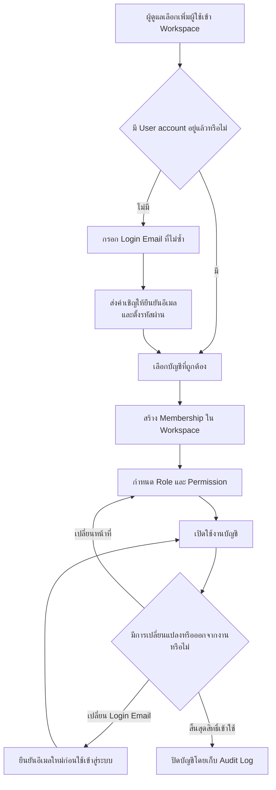

# User Accounts

User Accounts ใช้จัดการตัวตนที่สามารถเข้าสู่ MatterSolv ภายใน Workspace
ผู้ดูแลสำนักงานใช้หน้านี้สร้างหรือเชิญผู้ใช้ กำหนดสิทธิ์ และควบคุมสถานะการเข้าใช้ระบบ
โดยแยกออกจากทะเบียนบุคลากรใน [Employees](/docs/modules/employees)

## ข้อมูลของบัญชีผู้ใช้

| ข้อมูล | วัตถุประสงค์ | กฎสำคัญ |
| --- | --- | --- |
| ชื่อ | ระบุตัวผู้ใช้ในหน้าจอและประวัติการทำงาน | ไม่ใช้เป็นตัวเชื่อมกับ Employee record |
| Login Email | เข้าสู่ระบบ รับคำเชิญ และยืนยันความเป็นเจ้าของบัญชี | ต้องมีรูปแบบถูกต้องและไม่ซ้ำกับบัญชีอื่น |
| โทรศัพท์ | ใช้เป็นข้อมูลติดต่อของบัญชี | ไม่ใช้แทน Login Email |
| Role | กำหนดสิทธิ์พื้นฐานภายใน Workspace | ต้องเลือกตามหน้าที่ของผู้ใช้ |
| Permission | เพิ่มหรือลดขอบเขตจาก Role พื้นฐาน | Backend ต้องเป็นผู้บังคับใช้สิทธิ์จริง |
| ภาษา | กำหนดภาษาที่ผู้ใช้ต้องการ | ไม่เปลี่ยนข้อมูลหรือภาษาของผู้ใช้อื่น |
| สถานะ | ควบคุมว่าบัญชีเข้าใช้ Workspace ได้หรือไม่ | การปิดบัญชีต้องเก็บประวัติและ Audit Log ไว้ |

Login Email เป็นข้อมูลของ User account ไม่ใช่ Work Email หรือ Private Email
ในทะเบียนพนักงาน แม้ระบบจะเสนอ Work Email เป็นค่าเริ่มต้นเมื่อสร้างบัญชีใหม่
การเปลี่ยนอีเมลแต่ละประเภทต้องทำแยกกันตามเจ้าของข้อมูล

## Workflow บัญชีผู้ใช้

## กฎการสร้างและเชิญผู้ใช้

1. ผู้ดูแลต้องตรวจ Login Email ก่อนส่งคำเชิญ หากอีเมลมีบัญชีอยู่แล้ว
   ให้เลือกบัญชีเดิมที่ถูกต้องแทนการสร้างบัญชีซ้ำ
2. บัญชีเริ่มเข้า Workspace ได้หลังจากยืนยันอีเมล ตั้งรหัสผ่าน และได้รับ
   Membership พร้อม Role ที่เหมาะสมแล้ว
3. หากคำเชิญหมดอายุ ผู้ดูแลส่งคำเชิญใหม่ไปยัง Login Email เดิมได้
   โดยไม่สร้าง User account เพิ่ม
4. Workspace ต้องมีบัญชีผู้ดูแลระบบที่ใช้งานได้อย่างน้อยหนึ่งบัญชี
   ระบบจึงต้องไม่อนุญาตให้ปิดหรือลดสิทธิ์ผู้ดูแลระบบคนสุดท้าย
5. Role กำหนดสิทธิ์พื้นฐาน ส่วน Permission เฉพาะบุคคลใช้ปรับขอบเขตเพิ่มเติม
   ดูรายละเอียดที่ [Roles](/docs/roles) และ [Permissions](/docs/roles/permissions)

## ความสัมพันธ์กับ Employee record

User account และ Employee record เป็นข้อมูลคนละชุดและมี lifecycle แยกจากกัน:

- สำนักงานสร้าง Employee record ได้แม้บุคลากรคนนั้นไม่ต้องเข้าใช้ MatterSolv
- ผู้ใช้ที่ต้องทำงานในระบบสามารถเชื่อมกับ Employee record ที่ถูกต้องด้วย ID
  โดยไม่ใช้ข้อความอีเมลเป็นตัวเชื่อม
- การเชื่อมช่วยให้ระบบอ้างอิงบุคคลเดียวกันในการมอบหมายงาน การตรวจสิทธิ์
  และ Audit Log แต่ไม่ทำให้การแก้ข้อมูลชุดหนึ่งเปลี่ยนอีกชุดโดยอัตโนมัติ
- การ Deactivate Employee ไม่ปิด User account อัตโนมัติ และการปิด User account
  ไม่ลบหรือปิด Employee record อัตโนมัติ

ดูรายละเอียด Work Email, Private Email และ lifecycle ของบุคลากรที่
[Employees](/docs/modules/employees)

## การเปลี่ยนและปิดบัญชี

- การเปลี่ยน Login Email ต้องตรวจความไม่ซ้ำและยืนยันอีเมลใหม่ก่อนใช้เข้าสู่ระบบ
- การเปลี่ยน Role หรือ Permission ต้องมีผลตาม Membership ของ Workspace
  และบันทึกผู้ดำเนินการกับเวลาที่เปลี่ยน
- เมื่อผู้ใช้ไม่ควรเข้า Workspace อีก ให้ปิดการใช้งานแทนการลบบัญชีถาวร
- การปิดบัญชีต้องระงับการเข้าสู่ระบบ แต่ยังคงชื่อผู้ดำเนินการ ประวัติงาน
  ความสัมพันธ์กับข้อมูลเดิม และ Audit Log เพื่อให้ตรวจสอบย้อนหลังได้

## Related Documents

- [Administration Overview](/docs/modules/administration) — การตั้งค่า Workspace และข้อมูลกลาง
- [Employees](/docs/modules/employees) — ทะเบียนบุคลากรและข้อมูลติดต่อ
- [Roles](/docs/roles) — บทบาทผู้ใช้งาน
- [Permissions](/docs/roles/permissions) — ขอบเขตสิทธิ์ของแต่ละบทบาท
