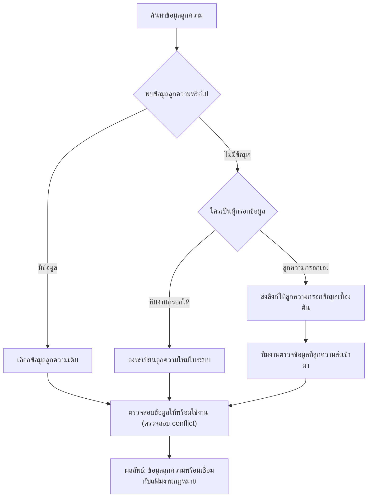

import { ModuleQuestionLinks } from '../../questions/_components/module-question-links'

# Clients

โมดูลลูกความเก็บข้อมูลของ Client (ลูกความ/ผู้รับบริการ) ไว้เป็นชุดเดียว
แล้วเชื่อมไปยังแฟ้มงานกฎหมาย เอกสาร ใบเสนอราคา และการวางบิลทั้งหมดของลูกความรายนั้น
เพื่อไม่ให้เกิดข้อมูลซ้ำและตอบได้ว่าลูกความรายหนึ่งมีงานอะไรกับสำนักงานอยู่บ้าง

ผู้ใช้หลักคือทนายผู้รับผิดชอบ ทีมธุรการที่รับเรื่องเข้าระบบ และทีมการเงิน

## Client Workflow

ลำดับงานสำหรับค้นหา ลงทะเบียน และตรวจข้อมูลลูกความให้พร้อมก่อนเชื่อมกับ
`Matter` (แฟ้มงานกฎหมาย)

ก่อนสร้างแฟ้มงาน ให้ค้นหาลูกความเดิมก่อนเสมอเพื่อลดข้อมูลซ้ำ หากลูกความ
กรอกข้อมูลผ่านลิงก์ ทีมงานต้องตรวจสอบข้อมูลสำคัญ เช่น รหัสลูกความ
เลขบัตรประชาชนหรือเลขทะเบียนนิติบุคคล และประเภทลูกความก่อนนำไปใช้งาน

## ข้อมูลและการรับลูกความ

- ลูกความแต่ละรายต้องมีรหัสลูกความของตนเองเสมอ
- ลูกความนิติบุคคลต้องบันทึกผู้ติดต่อได้หลายคน โดยระบบต้องกำหนดจำนวนสูงสุด
  ของผู้ติดต่อที่เพิ่มได้ ผู้ติดต่อไม่ต้องมีบทบาทหรือลำดับ และอีเมลแจ้งเตือน
  ให้ส่งถึงผู้ติดต่อทุกคนในรายการ
- เมื่อลูกความเดิมกลับมาใช้บริการ ระบบต้องค้นหาและนำข้อมูลเดิมมาเชื่อมกับ
  แฟ้มงานใหม่
- ข้อมูลที่ลูกความกรอกจากลิงก์สาธารณะต้องเข้าสู่รายการรอตรวจสอบก่อนเป็น
  ข้อมูลลูกความที่ใช้งานได้ โดยทนายเป็นผู้อนุมัติ และลิงก์ต้องมีวันหมดอายุ

## ความสัมพันธ์กับแฟ้มงานกฎหมาย

- แฟ้มงานกฎหมายหนึ่งรายการสามารถเชื่อมกับลูกความได้มากกว่าหนึ่งราย
- ลูกความหลายรายในแฟ้มงานเดียวกันใช้หมายเลขแฟ้มงานเดียวกัน แต่ลูกความแต่ละราย
  มีรหัสลูกความแยกกัน โดยออกเลขลูกความให้เฉพาะรายการที่เป็นลูกความเท่านั้น
- เมื่อลูกความรายหนึ่งถอนตัว ให้ถอนเฉพาะลูกความรายนั้น โดยแฟ้มงานกฎหมาย
  ยังคงดำเนินต่อได้

## สิทธิ์การเข้าถึงข้อมูล

- ลูกความจะเข้าถึงข้อมูลได้เมื่อทนายหรือผู้ดูแลระบบส่งข้อมูลหรือลิงก์ให้เท่านั้น
  และสามารถกรอกข้อมูลส่วนตัวผ่านลิงก์ที่ทนายส่งให้
- ต้องกำหนดขอบเขตสิทธิ์ของทนายในการแชร์ข้อมูลให้ลูกความอย่างชัดเจน
- เมื่อลูกความหลายรายอยู่ในแฟ้มงานเดียวกัน แต่ละรายเห็นข้อมูลแฟ้มงานได้
  แต่ต้องไม่เห็นค่าบริการของลูกความรายอื่น เว้นแต่มีการแชร์ค่าบริการร่วมกัน
  หากตกลงค่าบริการแยกกัน ต้องปิดข้อมูลค่าบริการของแต่ละฝ่าย
- ฝ่ายบัญชีต้องไม่เห็นเนื้อความของแฟ้มงานกฎหมาย

## เอกสารสำหรับลูกความ

- เมื่อแฟ้มงานมีลูกความหลายราย ผู้ใช้งานต้องเลือกได้ว่าจะออกใบเสนอราคาและ
  ใบวางบิลให้ลูกความรายใด หรือแบ่งออกให้ลูกความหลายราย

## ฟังก์ชันการทำงานหลัก

### ทะเบียนลูกความ

- ลงทะเบียนลูกความใหม่พร้อมข้อมูลพื้นฐาน เช่น ชื่อ ที่อยู่ เบอร์โทร อีเมล
  รหัสลูกความ และเลขบัตรประชาชนหรือเลขทะเบียนนิติบุคคล
- แยกประเภทลูกความ เช่น บุคคลธรรมดา นิติบุคคล บริษัท หรือองค์กรภาครัฐ
- เชื่อมลูกความกับแฟ้มงานกฎหมายทั้งหมดที่เกี่ยวข้อง
- บันทึกประวัติการติดต่อ ทั้งการโทร อีเมล นัดหมาย และข้อสรุปจากการประชุม

### ให้ลูกความกรอกข้อมูลเอง

- ส่งลิงก์ให้ลูกความกรอกข้อมูลเข้าระบบด้วยตนเอง
  แทนการให้ทีมงานคีย์ข้อมูลแทนทั้งหมด
- ให้ลูกความติดตามสถานะแฟ้มงานกฎหมายของตน
- เปิดให้ลูกความเห็นเฉพาะเอกสารที่สำนักงานเลือกเผยแพร่
- เก็บแบบสำรวจความพึงพอใจของลูกความ

### ดูแลความสัมพันธ์

- ทำเครื่องหมายลูกความสำคัญเพื่อจัดลำดับการให้บริการ
- ดูแลลูกความที่จ่ายค่าบริการแบบรายเดือนหรือรายปี
- ส่งอีเมลและการแจ้งเตือนอัตโนมัติ เช่น แจ้งเตือนก่อนสัญญาว่าจ้างหมดอายุ
- แสดงสถานะปัจจุบันของคดีที่ลูกความเกี่ยวข้อง พร้อมหมายเหตุและเอกสารที่แนบไว้

<ModuleQuestionLinks module="clients" />

## Related Documents

- [Business Workflow](/docs/workflow) — ขั้นตอน "จัดการลูกความ"
- [Matters](/docs/modules/matters) — แฟ้มงานกฎหมายที่ผูกกับลูกความ
- [Quotations](/docs/modules/quotations) — ใบเสนอราคาที่ออกให้ลูกความ
- [Reports](/docs/modules/reports) — รายงานลูกความและพฤติกรรมการใช้บริการ
- [Permissions](/docs/roles/permissions) — ผู้ใช้คนใดเข้าถึงข้อมูลลูกความได้
