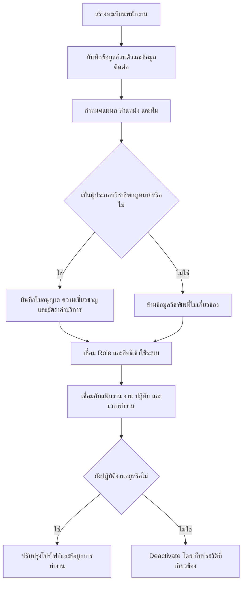

import { ModuleQuestionLinks } from '../../questions/_components/module-question-links'

# Employees

โมดูล Employees เป็นทะเบียนกลางของ `Employee` (พนักงานในสำนักงานทนายความ)
ครอบคลุม Partner, Lawyer, ผู้ช่วยทนาย ทีมธุรการ ฝ่ายการเงิน ทีม HR
และบุคลากรสนับสนุน เพื่อให้สำนักงานมีข้อมูลบุคลากร ตำแหน่ง คุณสมบัติวิชาชีพ
สถานะการทำงาน และความสัมพันธ์กับงานอยู่ในโปรไฟล์เดียวกัน

ผู้ใช้หลักคือผู้ดูแลสำนักงานและทีม HR ส่วนหัวหน้าทีมใช้ข้อมูลตำแหน่ง ความเชี่ยวชาญ
และภาระงานประกอบการจัดทีม พนักงานทั่วไปเข้าดูหรือแก้ไขข้อมูลของตนได้ตาม Permission
ที่ได้รับ

## Employee Workflow

Employee record กับ User account เป็นคนละสิ่งกัน พนักงานหนึ่งคนมีทะเบียนบุคลากรได้
แม้ยังไม่มีบัญชีเข้าใช้ระบบ ส่วนการเชิญเข้าใช้ การปิดบัญชี และการกำหนดนโยบาย Role
หรือ Permission อยู่ภายใต้ [Administration](/docs/modules/administration)

## ความสัมพันธ์กับ System Settings และ Users

ผู้ดูแลสำนักงานดูแลข้อมูลบุคลากรจาก Employees และดูแลการเข้าใช้ระบบจาก
[Administration](/docs/modules/administration) โดยแยกการตัดสินใจออกจากกัน:

| ข้อมูล | เจ้าของ | ใช้ทำอะไร |
| --- | --- | --- |
| Employee record | Employees | เก็บข้อมูลบุคลากร ตำแหน่ง คุณสมบัติ และสถานะการทำงาน |
| User account | System Settings / Users | ยืนยันตัวตน กำหนด Role, Permission, ภาษา และสถานะเข้าใช้ระบบ |
| รหัสพนักงาน | System Settings | กำหนดคำนำหน้ารหัสพนักงานที่ใช้ตามมาตรฐานของ Workspace |

ในการ Onboard ให้สร้างทะเบียนพนักงานก่อนเมื่อสำนักงานต้องเก็บข้อมูลบุคลากร
แล้วจึงเชิญหรือเชื่อม User account เฉพาะผู้ที่ต้องเข้าใช้ระบบ เมื่อพนักงานออกจากงาน
ให้ Deactivate ทะเบียนพนักงานและปิดบัญชีแยกกันตามนโยบายที่อนุมัติ เพื่อรักษา
ประวัติการทำงานและ Audit Log

## Key Capabilities

### ทะเบียนและการค้นหา

- แสดงรายการพนักงานพร้อมรหัส ชื่อ แผนก ตำแหน่ง บทบาท และสถานะ
- ค้นหาและกรองพนักงานจากข้อมูลที่ใช้จัดทีมได้
- เพิ่ม ดู แก้ไข และ Deactivate พนักงาน โดยคงการอ้างอิงจากแฟ้มงาน
  Timesheet, Billing และ Audit Log
- แยกสถานะการปฏิบัติงานออกจากสถานะบัญชีผู้ใช้ เพื่อไม่ให้การปิดบัญชีทำลาย
  ประวัติบุคลากร

### โปรไฟล์พนักงาน

- เก็บรูปโปรไฟล์ แผนก คำนำหน้า ชื่อ นามสกุล และหลายตำแหน่งภายในสำนักงาน
- เก็บข้อมูลติดต่อ เช่น โทรศัพท์ อีเมล LINE ID และ WeChat
- เก็บที่อยู่ตามเอกสารประจำตัวและที่อยู่ติดต่อ โดยเลือกใช้ที่อยู่เดียวกันได้
- เก็บภาษา ทักษะ ความเชี่ยวชาญ หมายเหตุ และไฟล์แนบที่เกี่ยวข้อง
- ข้อมูลอ่อนไหว เช่น เลขประจำตัว หนังสือเดินทาง ที่อยู่ และเอกสารใบอนุญาต
  ต้องแสดงและแก้ไขได้เฉพาะผู้มี Permission พร้อมบันทึก Audit Log

### คุณสมบัติวิชาชีพ

ข้อมูลส่วนนี้แสดงเมื่อเกี่ยวข้องกับตำแหน่งหรือประเภทพนักงาน ไม่บังคับกับบุคลากรทุกคน

- บันทึกสถานะ เลขที่ ประเภท และวันหมดอายุของใบอนุญาตทนายความ
- เพิ่มใบอนุญาตหรือคุณวุฒิอื่นได้หลายรายการ พร้อมเอกสารประกอบ
- เก็บความเชี่ยวชาญทางกฎหมายและภาษาที่ใช้ทำงาน
- เก็บอัตราค่าบริการวิชาชีพต่อชั่วโมงสำหรับงานที่คิดค่าบริการตามเวลา

### ทีม บทบาท และสิทธิ์

- จัดโครงสร้างทีมตามตำแหน่งและความรับผิดชอบ เช่น Partner, Lawyer,
  Assistant, Admin หรือ Accounting
- เชื่อมพนักงานกับ Role หรือ Permission bundle ที่ระบบกำหนดไว้
- ปรับสิทธิ์เมื่อ Onboard, เปลี่ยนบทบาท หรือ Deactivate โดยไม่ใช้ชื่อตำแหน่ง
  เป็น Permission โดยตรง
- การเห็นรายชื่อหรือข้อมูลพนักงานใช้ขอบเขต ตนเอง ทีม ลูกทีม หรือทั้งสำนักงาน
  ตามสิทธิ์ที่ได้รับ

### ข้อมูลการทำงานที่เชื่อมโยง

หน้ารายละเอียดพนักงานแสดงความสัมพันธ์แบบอ่านอย่างเดียวกับข้อมูลที่โมดูลอื่นเป็นเจ้าของ

- [Matters](/docs/modules/matters) และบริการด้านกฎหมายที่พนักงานรับผิดชอบ
- [Tasks](/docs/modules/tasks), [Calendar](/docs/modules/calendar)
  และ [Documents](/docs/modules/documents) ที่เกี่ยวข้อง
- Timesheet, Billable Hours, Workload และผลการทำงานที่คำนวณจากข้อมูลต้นทาง
- รายงานภาระงานของทีม เพื่อช่วยหัวหน้าทีมเห็นผู้ที่งานหนักหรือยังรับงานเพิ่มได้

Employees ไม่คำนวณเวลาทำงาน ยอดเรียกเก็บ หรือ Performance ซ้ำเอง
แต่ใช้ Employee ID เป็นจุดเชื่อมและแสดงผลจากโมดูลเจ้าของข้อมูล

## Boundary with Human Resources

Employees เป็นเจ้าของทะเบียนและโปรไฟล์ของบุคลากร ส่วน
[Human Resources](/docs/modules/hr) ใช้ทะเบียนนั้นเป็นข้อมูลตั้งต้นสำหรับ Payroll
และ Leave Management

ข้อมูลต่อไปนี้อยู่นอก Employees:

- การคำนวณเงินเดือน ภาษี ประกันสังคม กองทุน OT เบี้ยขยัน และโบนัส
- Payslip และการส่งออกข้อมูลเงินเดือนให้งานบัญชี
- คำขอลา ยอดวันลาคงเหลือ ลำดับอนุมัติ และปฏิทินการลา
- การนิยาม Permission catalogue และนโยบายความปลอดภัยระดับระบบ

## Open Decisions

- รูปแบบรหัสพนักงาน วันที่เริ่มงาน/สิ้นสุดงาน ประเภทการจ้าง หัวหน้างาน
  และเหตุผลการ Deactivate ยังไม่มี requirement ที่ยืนยัน
- การ “ลบ” พนักงานควรหมายถึง Deactivate หรือ Archive เป็นค่าเริ่มต้น
  ส่วน Hard delete ต้องมีกฎรองรับข้อมูลที่ถูกอ้างอิงและ Audit history ก่อน
- ต้องกำหนด Field-level Permission สำหรับข้อมูลอ่อนไหวและอัตราค่าบริการวิชาชีพ
- ต้องกำหนดช่วงเวลาแจ้งเตือน ผู้รับแจ้ง และผลหลังใบอนุญาตหมดอายุ
- Persona เช่น Managing Partner, Senior Lawyer และ Junior Lawyer
  ยังต้องมี mapping ไปยัง Runtime Role หรือ Permission bundle ที่อนุมัติแล้ว

<ModuleQuestionLinks module="employees" />

## Requirement Basis

หน้านี้สรุปจาก requirement และแบบหน้าจอใน `requirements/source/` ได้แก่
`MTS_Feature Detail(2).pdf`, `ALT Pro - P3 (MatterSolv).xlsx`,
`Role and Permission Alternate Pro_1.xlsx`, แบบแก้ไข/รายละเอียดข้อมูลทนาย
และรายงานภาระงานกับประสิทธิภาพทีม โดยใช้คำยืนยันของ Product ว่า Employees
หมายถึงพนักงานทุกประเภทในสำนักงานทนายความ ไม่ได้จำกัดเฉพาะทนาย

รายละเอียดการสืบค้นและประเด็นที่ยังไม่ชัดอยู่ใน
`docs/research/employees-module-requirements.md`

## Related Documents

- [Human Resources](/docs/modules/hr) — เงินเดือนและการลาที่อ้างอิงทะเบียนพนักงาน
- [Administration](/docs/modules/administration) — บัญชีผู้ใช้ Role และ Permission
- [Matters](/docs/modules/matters) — ทีมผู้รับผิดชอบและ Timesheet ของงานกฎหมาย
- [Reports](/docs/modules/reports) — รายงาน Workload และ Performance
- [Permissions](/docs/roles/permissions) — หลักการกำหนดสิทธิ์และขอบเขตข้อมูล
- [Requirement Register](/docs/reference/requirements) — requirement ต้นทางรายข้อ
