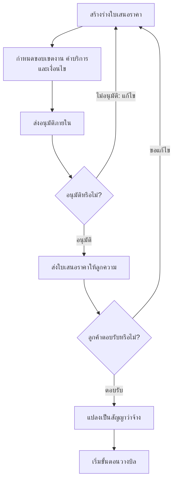

import { ModuleQuestionLinks } from '../../questions/_components/module-question-links'

# Quotations

โมดูลใบเสนอราคาใช้กำหนดขอบเขตบริการและค่าบริการที่จะเสนอต่อลูกความ
ตั้งแต่ร่างใบเสนอราคา ส่งอนุมัติภายใน ส่งให้ลูกความ จนถึงแปลงเป็นสัญญาว่าจ้าง
เมื่อลูกความตอบรับ

ผู้ใช้หลักคือทนายผู้รับผิดชอบงาน ทนายอาวุโสหรือหุ้นส่วนที่เป็นผู้อนุมัติ
และทีมที่ดูแลงานขายหรืองานธุรการของสำนักงาน

## Workflow

## Key Capabilities

### สร้างใบเสนอราคา

- สร้างจากแม่แบบมาตรฐาน โดยระบบดึงข้อมูลลูกความและค่าบริการมาเติมให้
- ระบุประเภทบริการ เช่น คำปรึกษากฎหมาย การร่างสัญญา หรือการดำเนินคดี
- รองรับรูปแบบค่าบริการแบบรายชั่วโมง (Hourly Rate), เหมาจ่าย (Flat Fee)
  และแบ่งตามงวดงาน (Milestone Payment)
- รองรับค่าธรรมเนียมพิเศษสำหรับงานเร่งด่วน และส่วนลดเฉพาะลูกความ

### อนุมัติและส่งให้ลูกความ

- ต้องผ่านการตรวจสอบและอนุมัติจากผู้มีอำนาจก่อนส่งถึงลูกความทุกครั้ง
- ส่งใบเสนอราคาให้ลูกความผ่านอีเมลจากในระบบ
- ติดตามสถานะใบเสนอราคาและบันทึกผลการตอบรับของลูกความ
- ค้นหาและกรองรายการใบเสนอราคาตามสถานะได้

### ขอบเขตงานและสัญญา

- แนบข้อตกลงการให้บริการไปกับใบเสนอราคา
- ระบุขอบเขตและข้อจำกัดของงานเพื่อป้องกันข้อโต้แย้งภายหลัง
- แปลงใบเสนอราคาที่ได้รับอนุมัติแล้วเป็นสัญญาว่าจ้าง
- เชื่อมกับ [Documents](/docs/modules/documents) เพื่อสร้างเอกสารประกอบอัตโนมัติ

### จัดเก็บและวิเคราะห์

- จัดเก็บใบเสนอราคาแยกตามลูกความ พร้อมค้นประวัติย้อนหลัง
- เปรียบเทียบราคาและเงื่อนไขที่เคยเสนอไปจากรายการบริการเดิม
- รายงานใบเสนอราคาที่ได้รับอนุมัติหรือถูกปฏิเสธ
  และสรุปประเภทบริการที่ถูกเสนอราคาบ่อยที่สุด

<ModuleQuestionLinks module="quotations" />

## Related Documents

- [Business Workflow](/docs/workflow) — ขั้นตอน "ตกลงราคาและขอบเขต"
- [Matters](/docs/modules/matters) — แฟ้มงานกฎหมายที่ใบเสนอราคาผูกอยู่
- [Billing](/docs/modules/billing) — การวางบิลหลังลูกความตอบรับ
- [Feature Comparison](/docs/plans/feature-comparison) — ฟีเจอร์ที่เปิดในแต่ละแผน
- [Permissions](/docs/roles/permissions) — ผู้ใช้คนใดสร้างหรืออนุมัติได้
