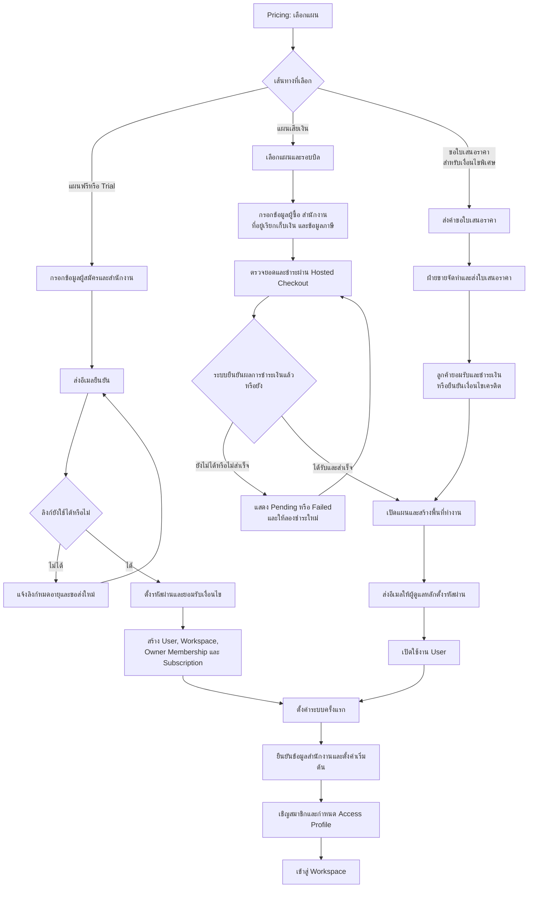
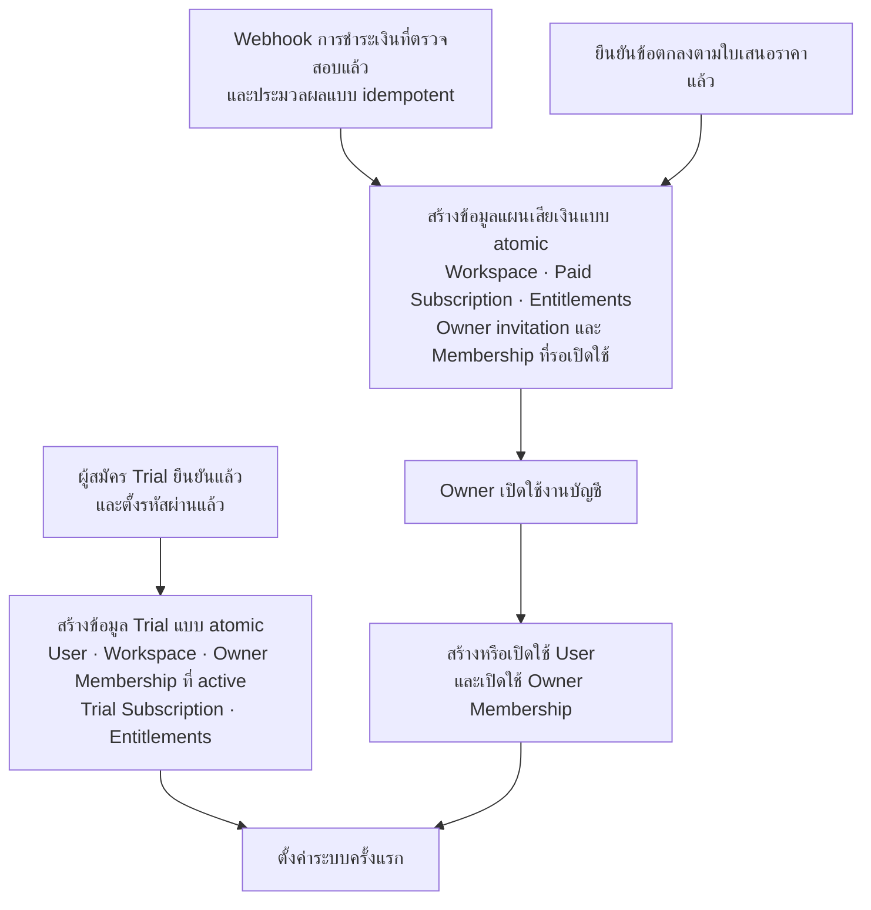
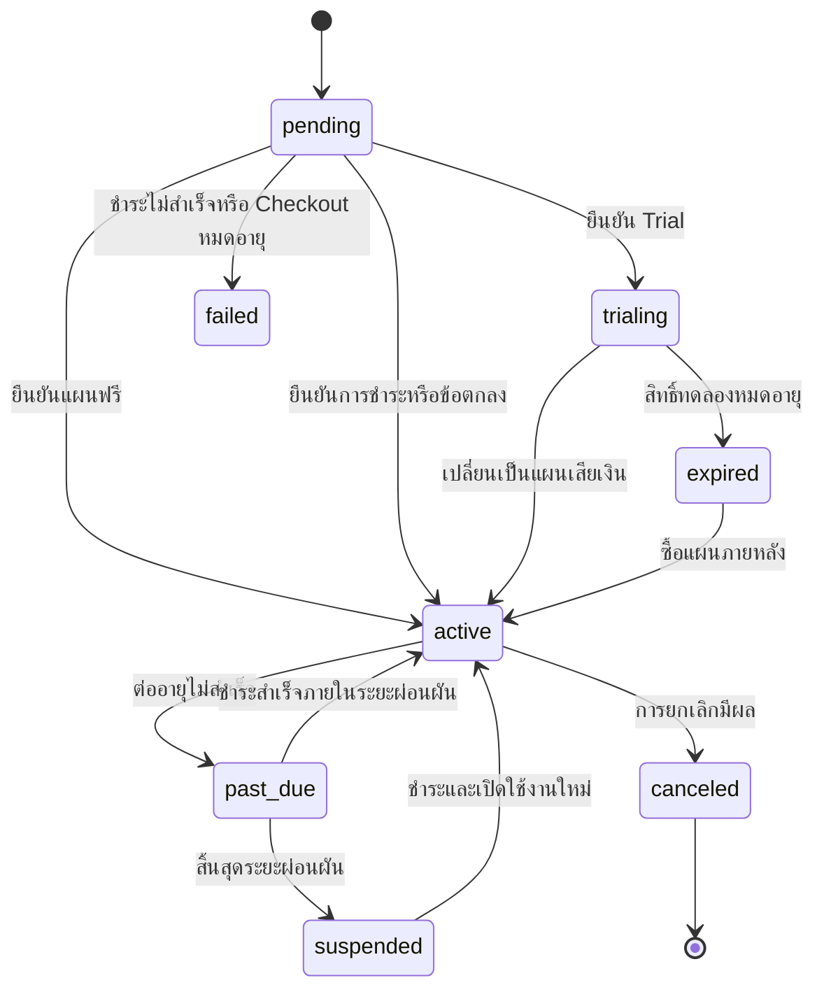

# การสมัคร แผน และสิทธิ์การใช้งาน

หน้านี้สรุปการสมัครใช้งาน การชำระเงิน การเข้าสู่ระบบ และการกำหนดสิทธิ์

## คำสำคัญ

เอกสารนี้ใช้คำห้าคำต่อไปนี้ตลอดทั้งหน้า แต่ละคำควบคุมคนละเรื่องและใช้แทนกันไม่ได้

| คำ             | ความหมาย                                                       | ควบคุม                |
| -------------- | -------------------------------------------------------------- | --------------------- |
| User           | บัญชีผู้ใช้งานหนึ่งบัญชี ผูกกับอีเมลที่ยืนยันแล้ว              | การพิสูจน์ตัวตน       |
| Workspace      | พื้นที่ข้อมูลของสำนักงานหนึ่งแห่ง แยกจาก Workspace อื่นเด็ดขาด | ขอบเขตข้อมูล          |
| Subscription   | แผนที่ Workspace ใช้อยู่ กำหนดว่าโมดูลใดเปิดใช้ได้             | สิทธิ์ระดับ Workspace |
| Membership     | การที่ User หนึ่งบัญชีเป็นสมาชิกของ Workspace หนึ่งแห่ง        | ความเป็นสมาชิก        |
| Access Profile | ชุดสิทธิ์ที่กำหนดให้สมาชิกแต่ละคนภายใน Workspace               | สิทธิ์ระดับผู้ใช้     |

User หนึ่งบัญชีมี Membership ได้หลายรายการ จึงเข้าถึงได้หลาย Workspace
โดยสิทธิ์ในแต่ละ Workspace แยกจากกัน

## ขั้นตอนการสมัครใช้งาน

ส่วนนี้กำหนด flow เป้าหมายของ MatterSolv สำหรับการเลือกแผน สมัครใช้งาน
ชำระเงิน สร้างพื้นที่ทำงาน เปิดใช้บัญชีผู้ดูแลหลัก และตั้งค่าระบบครั้งแรก

### แผนฟรีหรือช่วงทดลอง

แผนฟรีและ Trial ไม่ต้องใช้บัตรเครดิต ผู้สมัครกรอกข้อมูลและยืนยันอีเมลก่อนระบบ
สร้าง Workspace เพราะยังไม่มีการชำระเงินเป็นสัญญาณยืนยัน ระบบส่งรหัสยืนยัน 6 หลัก
ไปที่อีเมล ผู้สมัครกรอกรหัสในหน้าจอ แล้วตั้งรหัสผ่าน จากนั้นระบบสร้าง User,
Workspace, Owner Membership และ Subscription พร้อมกัน ผู้สมัครจึงเริ่มตั้งค่าระบบ
ครั้งแรกได้ แผนฟรีมีสถานะ `active` ส่วน Trial มีสถานะ `trialing`
และวันหมดอายุตามเงื่อนไขที่กำหนด

รหัสยืนยันมีอายุ 10 นาที ใช้ได้ครั้งเดียว และกรอกผิดได้ไม่เกิน 5 ครั้ง หากหมดอายุ
หรือกรอกผิดครบจำนวน ผู้สมัครขอรหัสใหม่ได้ โดยยังไม่ได้สิทธิ์เข้าถึง Workspace
จนกว่ายืนยันสำเร็จ ดูเหตุผลเบื้องหลังกติกาเหล่านี้ที่
[Database](/docs/database)

### แผนเสียเงินแบบชำระเอง

ผู้ซื้อเลือกแผนและรอบบิล กรอกข้อมูลบัญชี ข้อมูลสำนักงาน ข้อมูลเรียกเก็บเงิน
และข้อมูลภาษี ก่อนตรวจยอดรวมและชำระเงิน ระบบคำนวณราคาอีกครั้งที่ Server
ข้อมูลราคาใน URL หรือ Browser ไม่ใช่ยอดที่ใช้เรียกเก็บจริง

การชำระเงินเกิดก่อนการเปิดใช้บัญชี เพื่อให้ผู้ซื้ออยู่ใน Checkout ต่อเนื่อง
ระบบสร้าง Subscription และ Workspace เมื่อได้รับ webhook ที่ตรวจสอบแล้วเท่านั้น
จากนั้นจึงส่งอีเมลให้ผู้ดูแลหลักตั้งรหัสผ่าน ซึ่งเป็นการยืนยันว่าผู้ดูแลหลัก
เข้าถึงอีเมลนั้นได้

### การขอใบเสนอราคา

ENTERPRISE มีราคาและซื้อผ่าน Self-service ได้เช่นเดียวกับแผนเสียเงินอื่น ลูกค้าที่
ต้องการราคา เงื่อนไขเครดิต หรือข้อตกลงพิเศษจึงเลือกส่งข้อมูลสำนักงาน ผู้ติดต่อ
จำนวนสมาชิกโดยประมาณ และความต้องการให้ฝ่ายขายจัดทำใบเสนอราคา เมื่อลูกค้ายอมรับ
และชำระเงินหรือได้รับอนุมัติเงื่อนไขเครดิตแล้ว ระบบใช้ขั้นตอนสร้าง Workspace และ
Owner ชุดเดียวกับแผน Self-service

เส้นทางนี้เพิ่มขั้นตอนทางการขายได้ แต่ต้องไม่สร้าง User, Workspace หรือ
Subscription คนละรูปแบบกับเส้นทางอื่น

## เงื่อนไขการสร้างบัญชีและพื้นที่ทำงาน

การยืนยัน Free Plan หรือรายการทางการค้าที่สำเร็จต้องสร้างข้อมูลที่เกี่ยวข้องเป็น
ธุรกรรมเดียว หากส่วนใดล้มเหลว ระบบต้องย้อนกลับหรือเก็บสถานะที่กู้คืนได้
การกลับมาจากหน้าชำระเงินใน Browser ไม่ใช่เหตุให้เปิดใช้งาน ระบบเริ่มสร้างข้อมูล
สำหรับแผนเสียเงินได้ต่อเมื่อได้รับ webhook ที่ตรวจสอบและประมวลผลแบบ idempotent แล้ว
โดย Django เป็นผู้ดูแลขอบเขตธุรกรรมและการแยก Workspace

### แผนผังการสร้างบัญชีและพื้นที่ทำงาน

| ข้อมูล | สร้างเมื่อ | หน้าที่ |
| --- | --- | --- |
| Pending Signup | รับแบบฟอร์มแผนฟรีหรือ Trial | เก็บข้อมูลผู้สมัครและสถานะยืนยันโดยยังไม่ให้สิทธิ์ Workspace |
| Checkout Session | เริ่มซื้อแผนเสียเงิน | เก็บแผน รอบบิล ยอด และสถานะชำระเงินที่ Server ยืนยัน |
| Payment Transaction | เริ่มชำระเงิน | เชื่อมรายการกับ Payment Provider โดยไม่เก็บข้อมูลบัตรดิบ |
| User | ยืนยัน Free Plan หรือตั้งรหัสผ่าน Owner สำเร็จ | ใช้พิสูจน์ตัวตนด้วยอีเมลที่ยืนยันแล้ว |
| Workspace | ยืนยัน Free Plan หรือรายการทางการค้าสำเร็จ | เป็นขอบเขตข้อมูลของสำนักงาน |
| Membership | สร้าง Workspace; เปิดใช้เมื่อ Owner ของแผนเสียเงินเปิดใช้งานคำเชิญ | เชื่อม User คนแรกเป็น Owner และสมาชิกที่เชิญภายหลัง |
| Subscription | สร้าง Workspace | เก็บแผน สถานะ รอบบิล และข้อมูลต่ออายุ |
| Entitlements | เปิด Subscription หรือเปลี่ยนแผน | ระบุ Module และข้อจำกัดที่ Workspace ใช้ได้ |

## สถานะแผนใช้งาน

นโยบายการเข้าถึงข้อมูลในสถานะ `expired`, `suspended` และ `canceled`
ต้องกำหนดแยกก่อนพัฒนา Billing โดย Backend เป็นผู้บังคับใช้

### ลำดับการตรวจสอบสิทธิ์

ระบบตรวจสิทธิ์สามชั้นตามลำดับทุกครั้งที่มีการทำรายการ

1. **Authentication** ตรวจว่าเป็น User ที่ยืนยันตัวตนแล้ว
2. **Entitlement** ตรวจว่า Subscription ของ Workspace เปิดโมดูลนั้น
3. **Authorization** ตรวจว่า Access Profile ของสมาชิกอนุญาตให้ทำรายการนั้น

หากไม่ผ่านชั้นใดชั้นหนึ่ง ระบบปฏิเสธรายการนั้น การเปลี่ยนแผนจึงไม่เปลี่ยนสิทธิ์
ของสมาชิก และการเพิ่มสิทธิ์ให้สมาชิกไม่เปิดโมดูลที่แผนไม่รองรับ

## รูปแบบพื้นที่ทำงาน

ทุกการสมัครสร้าง Workspace ในรูปแบบเดียวกัน ผู้สมัครเป็น Owner
และเป็นสมาชิกคนแรกของ Workspace นั้น

- Workspace ของผู้ใช้งานคนเดียวมีสมาชิกหนึ่งคน
  และมีโครงสร้างเหมือน Workspace ของสำนักงานที่มีหลายคน
- Owner เชิญสมาชิกเพิ่มได้ทุกแผน เพราะทุกแผนไม่จำกัดจำนวนสมาชิก
- Workspace ที่เริ่มจากสมาชิกหนึ่งคนเพิ่มสมาชิกภายหลังได้โดยไม่ต้องย้ายข้อมูล

ภาพรวมการสมัครในกระบวนการธุรกิจทั้งหมดอยู่ใน
[Business Workflow](/docs/workflow) ขั้นที่ 1

## กฎการชำระเงิน

- STANDARD ไม่ต้องใช้บัตรเครดิต
- แผนเสียเงินรับข้อมูลบัตรผ่าน Hosted Checkout เท่านั้น
- MatterSolv ไม่เก็บหมายเลขบัตรหรือรหัส CVC
- หน้า Payment Success ไม่ใช่หลักฐานเปิดใช้งาน
- ระบบเปิดหรือต่ออายุ Subscription เมื่อได้รับ webhook ที่ตรวจสอบแล้ว
- Webhook เดิมที่ถูกส่งซ้ำต้องไม่สร้าง Subscription หรือรายการชำระเงินซ้ำ

## การจัดการเมื่อเกิดข้อผิดพลาด

- หากอีเมลมี User อยู่แล้ว ให้เจ้าของอีเมลเข้าสู่ระบบแล้วทำรายการต่อ
  ห้ามสร้าง User ซ้ำ
- หากลิงก์ยืนยันหมดอายุ ให้ส่งลิงก์ใหม่แบบจำกัดความถี่
- หากชำระไม่สำเร็จ ห้ามสร้าง Active Subscription และต้องให้ลองใหม่ได้โดยไม่
  สร้าง Payment Transaction ซ้ำผิดรายการ
- หากชำระสำเร็จแต่ผู้ซื้อปิด Browser ระบบยังต้องสร้าง Workspace จาก webhook
  และส่งอีเมลเปิดใช้บัญชีผู้ดูแลหลัก
- Webhook ที่ส่งซ้ำต้องประมวลผลแบบ idempotent โดยอ้างอิง Provider Event ID
- หากสร้างข้อมูลได้เพียงบางส่วน ต้องย้อนธุรกรรมหรือเข้าสถานะกู้คืนที่ชัดเจน
  ห้ามเหลือ Active Subscription ที่ไม่มี Workspace
- หากลิงก์เปิดใช้บัญชีผู้ดูแลหลักหมดอายุ ต้องออกลิงก์ใหม่ได้หลังตรวจความสัมพันธ์กับ
  Checkout หรือ Subscription

## สิทธิ์ของสมาชิก

ระบบมี Starter Access Profiles ได้แก่ Admin, Lawyer, Assistant, Finance, HR และ
Manager ชุดเหล่านี้เป็นค่าเริ่มต้น ไม่ใช่ Role ที่บังคับทุกบริษัท
และใช้ได้ทุกแผนเพราะการกำหนดสิทธิ์ตามบทบาทเป็นความสามารถพื้นฐานของระบบ

Role/Group ใน Access Profile กำหนด action เช่น ดู เพิ่ม แก้ไข ลบ อนุมัติ
หรือ Export และใช้ได้ทุกแผน หากสมาชิกต้องมี action ต่างจาก Role เดิม ให้ Admin
สร้าง Role เพิ่มแล้วมอบหมาย ไม่แก้ CRUD permission ที่ User โดยตรง

**การกำหนด Individual Data Scope เพิ่มเติมเปิดใช้ตั้งแต่แผน PRO ขึ้นไป**
โดย Admin จำกัดข้อมูลของสมาชิกตามทีม คดี เอกสาร หรือรายการที่ได้รับมอบหมาย
Data Scope ไม่ให้ action ใหม่และไม่สามารถเปิด Module ที่ Subscription ไม่มี

Workspace ที่ใช้แผน STANDARD หรือ ESSENTIALS ใช้ Role และ Scope พื้นฐานของระบบ
ส่วน tenant isolation, Workspace filter และ default-deny บังคับใช้กับทุกแผนเสมอ

Admin ไม่สามารถเปิด Module ที่ Subscription ไม่มี หรือให้สิทธิ์ข้าม Workspace

## เอกสารที่เกี่ยวข้อง

- [Plans & Pricing](/docs/plans)
- [Pricing](/docs/plans/pricing)
- [Plan Rules](/docs/plans/plan-rules)
- [Users & Access](/docs/roles)
