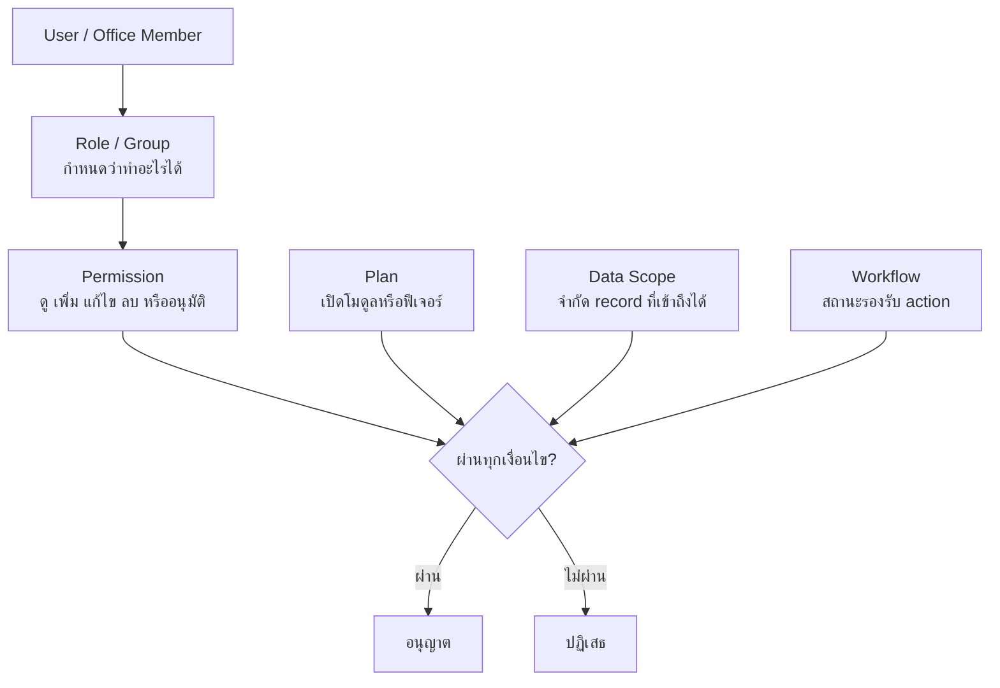
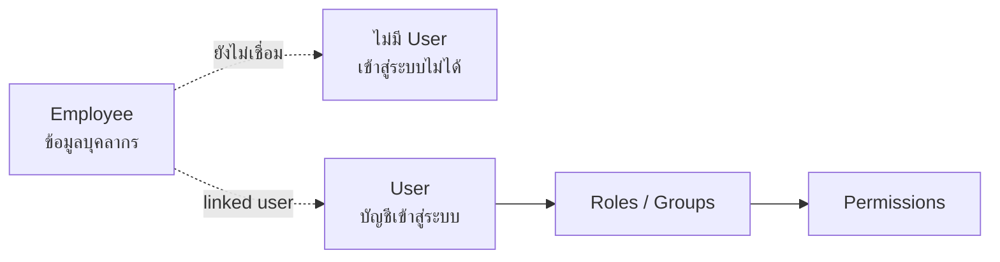
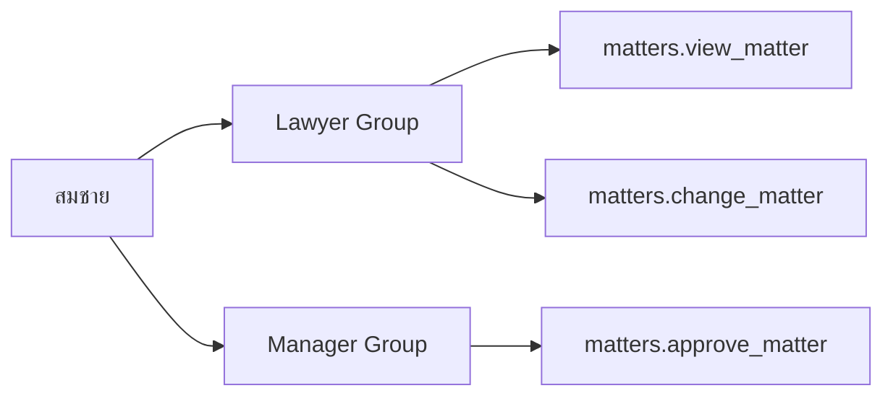
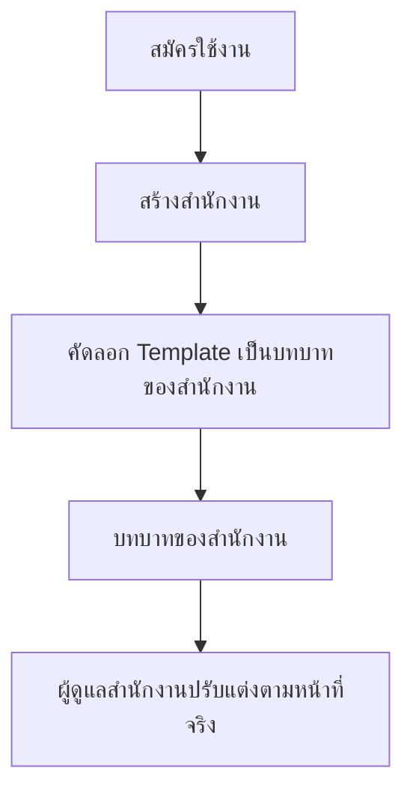

# Roles

Roles ใช้กำหนดว่าสมาชิกแต่ละคน **ทำอะไรได้** ในสำนักงาน ส่วน Data Scope
กำหนดว่าสมาชิกทำรายการนั้นกับ **ข้อมูลใดได้บ้าง** ทั้งสองอย่างเป็นคนละหน้าที่
และต้องผ่านเงื่อนไขของแผนกับ workflow เพิ่มเติม

สิทธิ์ผูกกับบัญชี User และสมาชิกภาพของสำนักงาน ไม่ได้ผูกกับ Employee
หรือตำแหน่งงานโดยอัตโนมัติ Employee เป็นข้อมูลบุคลากรเท่านั้น หาก Employee
ไม่มี User ที่เชื่อมอยู่ บุคคลนั้นจะไม่มีบัญชีสำหรับเข้าสู่ระบบ

## ภาพจำของระบบสิทธิ์

สมาชิกที่มีหลาย Role จะได้รับ Permission จากทุก Group รวมกันแบบ additive
หากไม่มี Group ใดให้ Permission ที่ต้องใช้ ระบบต้องปฏิเสธเป็นค่าเริ่มต้น

## ส่วนประกอบของระบบสิทธิ์ MatterSolv

MatterSolv แบ่งหน้าที่ของระบบสิทธิ์ออกเป็นส่วนที่ตรวจสอบและทดสอบแยกกันได้:

| ส่วนประกอบ | Implementation | หน้าที่ |
| --- | --- | --- |
| บัญชีและสมาชิกภาพ | Django User + Office Member | บัญชีที่เข้าสู่ระบบและรับ Role ของสำนักงาน |
| บทบาท | Office Role + Django Group | รวม Permission ตามหน้าที่งาน |
| สิทธิ์ดำเนินการ | Django CRUD และ custom Permission | กำหนดว่าอ่าน เพิ่ม แก้ไข ลบ หรือทำ action ใดได้ |
| ขอบเขตข้อมูล | Data Scope ใน authorization service | จำกัด record ตามสำนักงาน ทีม คดี หรือผู้รับผิดชอบ |
| การแสดงผล | React permission gate | ซ่อนหรือแสดงเมนูและปุ่มเพื่อ UX เท่านั้น |
| โมดูลตามแผน | Plan entitlement | กำหนดว่า Workspace เปิดใช้โมดูลหรือฟีเจอร์นั้นหรือไม่ |

### ตัวอย่าง Employee และ User

สมชายอาจมี Employee record สำหรับเก็บแผนก ตำแหน่ง และข้อมูลบุคลากร
แต่สิทธิ์ใช้งานมาจาก User ที่เชื่อมกับ Employee:

การเปลี่ยนตำแหน่ง Employee เป็น “HR Manager” ไม่ให้สิทธิ์เพิ่มเอง ต้องมอบหมาย
Role/Group ให้ User อย่างชัดเจน

## Django Group Contract

บทบาทที่สำนักงานใช้งานจริงหนึ่งรายการเท่ากับ Django `Group` หนึ่งรายการ
หน้าจออาจใช้คำว่า Access Profile แต่หมายถึง Role/Group contract เดียวกัน
และรายการสิทธิ์ของบทบาทเท่ากับความสัมพันธ์ `Group.permissions` ระบบใช้
Django `Permission` เดิมทั้งสิทธิ์มาตรฐานและสิทธิ์พิเศษ โดยไม่ปรับแก้
`django.contrib.auth` รายละเอียด codename และเงื่อนไข scope อยู่ใน
[Permissions](/docs/roles/permissions)

### สมาชิกที่มีหลาย Role

สมาชิกหนึ่งคนรับหลาย Role ได้เมื่อทำหน้าที่มากกว่าหนึ่งด้าน Permission จาก
ทุก Group จะรวมกัน แต่ Data Scope และ Workflow ยังจำกัดการใช้งานตามเดิม

## บทบาทเริ่มต้น

MatterSolv มีบทบาทพื้นฐาน 6 กลุ่มเป็น **Template
ระดับระบบ** เพื่อให้สำนักงานใหม่เริ่มทำงานได้ทันทีโดยไม่ต้องตั้งค่าเอง:

| บทบาท | เหมาะสำหรับ              | หน้าที่หลัก                                 |
| :------------: | ------------------------ | ------------------------------------------- |
|     Admin      | ผู้ดูแลสำนักงาน       | จัดการสมาชิก กลุ่มสิทธิ์ และการตั้งค่าระบบ  |
|     Lawyer     | ทนายและพนักงานกฎหมาย     | จัดการลูกความ แฟ้มงาน เอกสาร งาน และนัดหมาย |
|   Assistant    | ผู้ช่วยและผู้ประสานงาน   | เตรียมข้อมูล เอกสาร และติดตามงาน            |
|    Finance     | ฝ่ายการเงินและบัญชี      | ดูแลใบเสนอราคา การเรียกเก็บ และการชำระเงิน  |
|       HR       | ฝ่ายทรัพยากรบุคคล        | ดูแลบุคลากร เงินเดือน และการลา              |
|    Manager     | ผู้บริหารหรือผู้กำกับงาน | ดูภาพรวม มอบหมาย ตรวจสอบ และอนุมัติ         |

บทบาททั้ง 6 กลุ่มมีให้ใช้กับทุกแผน และไม่จำกัดจำนวนสมาชิกตามข้อมูล
Pricing ปัจจุบัน แต่สมาชิกจะใช้ได้เฉพาะโมดูลที่แผนของสำนักงานเปิดไว้

### Template and Clone

Template ไม่ใช่บทบาทที่สำนักงานใช้งานจริง เมื่อสร้างสำนักงานใหม่
ระบบจะคัดลอก Template มาเป็นบทบาทของสำนักงานนั้นโดยเฉพาะ

หลังคัดลอกแล้ว ผู้ดูแลสำนักงานจัดการชุดของตนเองได้เต็มที่

- เปลี่ยนชื่อบทบาทให้ตรงกับคำที่สำนักงานใช้
- เพิ่มบทบาทใหม่
- ลบบทบาทที่ไม่ได้ใช้
- แก้ไขว่าแต่ละบทบาทมีสิทธิ์อะไรบ้าง

### สิทธิ์จัดการบทบาท

การจัดการบทบาทแยกตามมาตรฐาน Django auth เพื่อมอบหมายหน้าที่เท่าที่จำเป็น:

| สิทธิ์ | รหัส |
| --- | --- |
| ดูบทบาท | `auth.view_group` |
| เพิ่มบทบาท | `auth.add_group` |
| แก้ไขบทบาทและกำหนดสิทธิ์ | `auth.change_group` |
| ลบบทบาท | `auth.delete_group` |

สมาชิกที่ไม่มี `auth.change_group` จะเปิดดูรายละเอียดได้เมื่อมี `auth.view_group`
แต่ไม่สามารถเปลี่ยนชื่อหรือแก้ไข checklist สิทธิ์ได้

การแก้ไขมีผลเฉพาะสำนักงานนั้น **สำนักงานต่างรายไม่ใช้บทบาท
ร่วมกัน** และการแก้ Template ภายหลังไม่กระทบสำนักงานที่เปิดใช้งานไปแล้ว

## Assignment Rules

- ผู้สมัครคนแรกเป็น ผู้ดูแลสำนักงาน
- ผู้สมัครคนเดียวใช้สำนักงานเดียวกับบริษัทที่มีสมาชิกคนเดียว
- ผู้ดูแลสำนักงานเลือกบทบาทให้สมาชิกแต่ละคน
- สมาชิกหนึ่งคนมีได้มากกว่าหนึ่งบทบาทเมื่อมีหน้าที่หลายด้าน
- กรณีสมาชิกต้องมี Permission แตกต่างจาก Role เดิม ให้สร้าง Role เพิ่มแล้ว
  มอบหมายให้สมาชิก ไม่เพิ่มหรือลด CRUD Permission ที่ตัว User โดยตรง
- ตั้งแต่แผน PRO ขึ้นไป ผู้ดูแลกำหนด Individual Data Scope เพิ่มเติมได้ เช่น
  จำกัดตามทีม คดี เอกสาร หรือรายการที่ได้รับมอบหมาย Data Scope ไม่ให้
  Permission ใหม่และไม่สามารถข้าม Plan หรือ Workflow
- ตำแหน่งงานไม่ให้สิทธิ์โดยอัตโนมัติ ต้องเลือกตามหน้าที่จริง
- การอนุมัติและข้อมูลสำคัญต้องกำหนดขอบเขตให้ชัดเจน
- บทบาทของสำนักงานหนึ่งใช้ได้เฉพาะสมาชิกของสำนักงานนั้น
  ห้ามมอบหมายข้ามสำนักงาน
- การระบุทนายผู้รับผิดชอบในแฟ้มงานไม่ได้ทำให้ทนายคนนั้นเปิดแฟ้มงานได้เอง
  ต้องกำหนดบทบาทและขอบเขตข้อมูลให้ด้วย มิฉะนั้นทนายจะมีชื่อในคดี
  แต่เปิดดูไม่ได้
- สำนักงานเลือกได้ว่าบทบาทใดมีสิทธิ์ใด แต่สร้างรหัสสิทธิ์ใหม่เองไม่ได้
  ดู [Permissions](/docs/roles/permissions)

## Relationship to Plans

- แผนกำหนดว่าสำนักงานเปิดใช้โมดูลหรือฟีเจอร์ใด
- บทบาทกำหนดว่าสมาชิกทำอะไรในโมดูลที่เปิดแล้วได้บ้าง และใช้ได้ทุกแผน
- การกำหนด Individual Data Scope เพิ่มเติมเปิดใช้ตั้งแต่แผน PRO ขึ้นไป
- หากแผนไม่รองรับโมดูล สมาชิกจะเข้าโมดูลนั้นไม่ได้แม้มีสิทธิ์อยู่
- การ Upgrade หรือ Downgrade ไม่เปลี่ยนบทบาทหรือ Data Scope
  โดยอัตโนมัติ
- เมื่อเปิดโมดูลใหม่ ผู้ดูแลสำนักงานควรตรวจสิทธิ์สมาชิกก่อนเริ่มใช้งาน

## Related Documents

- [Signup & Access](/docs/plans/subscription-access)
- [User Roles](/docs/roles/roles)
- [Permissions](/docs/roles/permissions)
- [Plans & Pricing](/docs/plans)
- [Plan Rules](/docs/plans/plan-rules)
