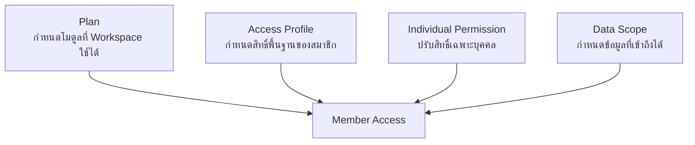
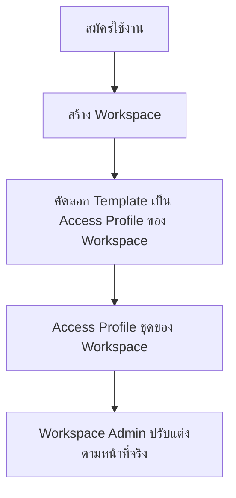

# Roles

Roles ใช้กำหนดว่าสมาชิกแต่ละคนเข้าถึงข้อมูลและทำอะไรใน Workspace ได้บ้าง
โดยแยกออกจากแผนราคาอย่างชัดเจน

## Access Model

สมาชิกเข้าใช้งานได้เมื่อแผนเปิดโมดูลนั้น และสิทธิ์ของสมาชิกอนุญาตให้ดำเนินการ
กับข้อมูลที่อยู่ในขอบเขตของตน

## Default Access Profiles

MatterSolv มี Access Profile พื้นฐาน 6 กลุ่มเป็น **Template
ระดับระบบ** เพื่อให้ Workspace ใหม่เริ่มทำงานได้ทันทีโดยไม่ต้องตั้งค่าเอง:

| Access Profile | เหมาะสำหรับ              | หน้าที่หลัก                                 |
| :------------: | ------------------------ | ------------------------------------------- |
|     Admin      | ผู้ดูแล Workspace        | จัดการสมาชิก กลุ่มสิทธิ์ และการตั้งค่าระบบ  |
|     Lawyer     | ทนายและพนักงานกฎหมาย     | จัดการลูกความ แฟ้มงาน เอกสาร งาน และนัดหมาย |
|   Assistant    | ผู้ช่วยและผู้ประสานงาน   | เตรียมข้อมูล เอกสาร และติดตามงาน            |
|    Finance     | ฝ่ายการเงินและบัญชี      | ดูแลใบเสนอราคา การเรียกเก็บ และการชำระเงิน  |
|       HR       | ฝ่ายทรัพยากรบุคคล        | ดูแลบุคลากร เงินเดือน และการลา              |
|    Manager     | ผู้บริหารหรือผู้กำกับงาน | ดูภาพรวม มอบหมาย ตรวจสอบ และอนุมัติ         |

Access Profile ทั้ง 6 กลุ่มมีให้ใช้กับทุกแผน และไม่จำกัดจำนวนสมาชิกตามข้อมูล
Pricing ปัจจุบัน แต่สมาชิกจะใช้ได้เฉพาะโมดูลที่แผนของ Workspace เปิดไว้

### Template and Clone

Template ไม่ใช่ Access Profile ที่ Workspace ใช้งานจริง เมื่อสร้าง Workspace ใหม่
ระบบจะคัดลอก Template มาเป็น Access Profile ชุดของ Workspace นั้นโดยเฉพาะ

หลังคัดลอกแล้ว Workspace Admin จัดการชุดของตนเองได้เต็มที่

- เปลี่ยนชื่อ Access Profile ให้ตรงกับคำที่สำนักงานใช้
- เพิ่ม Access Profile ใหม่
- ลบ Access Profile ที่ไม่ได้ใช้
- แก้ไขว่าแต่ละ Access Profile มีสิทธิ์อะไรบ้าง

การแก้ไขมีผลเฉพาะ Workspace นั้น **Workspace ต่างรายไม่ใช้ Access Profile
ร่วมกัน** และการแก้ Template ภายหลังไม่กระทบ Workspace ที่เปิดใช้งานไปแล้ว

## Assignment Rules

- ผู้สมัครคนแรกเป็น Workspace Admin
- ผู้สมัครคนเดียวใช้ Workspace เดียวกับบริษัทที่มีสมาชิกคนเดียว
- Workspace Admin เลือก Access Profile ให้สมาชิกแต่ละคน
- สมาชิกหนึ่งคนมีได้มากกว่าหนึ่ง Access Profile เมื่อมีหน้าที่หลายด้าน
- Workspace Admin ปรับสิทธิ์รายบุคคลเพิ่มเติมหรือลดจากค่าพื้นฐานได้
  เมื่อใช้แผน PRO ขึ้นไป
- ตำแหน่งงานไม่ให้สิทธิ์โดยอัตโนมัติ ต้องเลือกตามหน้าที่จริง
- การอนุมัติและข้อมูลสำคัญต้องกำหนดขอบเขตให้ชัดเจน
- Access Profile ของ Workspace หนึ่งใช้ได้เฉพาะสมาชิกของ Workspace นั้น
  ห้ามมอบหมายข้าม Workspace
- การระบุทนายผู้รับผิดชอบในแฟ้มงานไม่ได้ทำให้ทนายคนนั้นเปิดแฟ้มงานได้เอง
  ต้องกำหนด Access Profile และขอบเขตข้อมูลให้ด้วย มิฉะนั้นทนายจะมีชื่อในคดี
  แต่เปิดดูไม่ได้
- Workspace เลือกได้ว่า Access Profile ใดมีสิทธิ์ใด แต่สร้างรหัสสิทธิ์ใหม่เองไม่ได้
  ดู [Permissions](/docs/roles/permissions)

## Relationship to Plans

- แผนกำหนดว่า Workspace เปิดใช้โมดูลหรือฟีเจอร์ใด
- Access Profile กำหนดว่าสมาชิกทำอะไรในโมดูลที่เปิดแล้วได้บ้าง และใช้ได้ทุกแผน
- การปรับสิทธิ์รายบุคคลเพิ่มจาก Access Profile เปิดใช้ตั้งแต่แผน PRO ขึ้นไป
- หากแผนไม่รองรับโมดูล สมาชิกจะเข้าโมดูลนั้นไม่ได้แม้มีสิทธิ์อยู่
- การ Upgrade หรือ Downgrade ไม่เปลี่ยน Access Profile และสิทธิ์รายบุคคล
  โดยอัตโนมัติ
- เมื่อเปิดโมดูลใหม่ Workspace Admin ควรตรวจสิทธิ์สมาชิกก่อนเริ่มใช้งาน

## Related Documents

- [Signup & Access](/docs/plans/subscription-access)
- [User Roles](/docs/roles/roles)
- [Permissions](/docs/roles/permissions)
- [Plans & Pricing](/docs/plans)
- [Plan Rules](/docs/plans/plan-rules)
