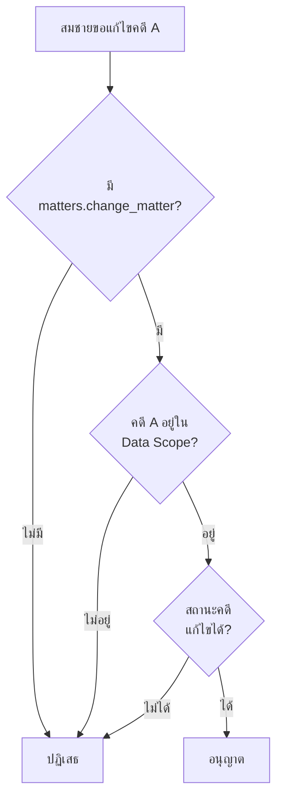

# Permissions

บทบาทของ MatterSolv ใช้ Django `Group` และ `Permission` เป็น contract หลัก
โดยไม่แก้ `django.contrib.auth`, `Group`, `Permission` หรือ `ModelBackend`

## Access Rules

สมาชิกใช้งานรายการหนึ่งได้เมื่อผ่านทุกเงื่อนไข:

1. บัญชีสมาชิกและสมาชิกภาพของสำนักงานยังใช้งานได้
2. แผนของสำนักงานเปิดโมดูลหรือฟีเจอร์นั้น
3. อย่างน้อยหนึ่ง Django Group ของสมาชิกมี permission ที่ต้องใช้
4. ข้อมูลอยู่ในสำนักงาน ทีม สำนวน หรือขอบเขตที่ได้รับมอบหมาย
5. สถานะ workflow และระดับอนุมัติรองรับการดำเนินการ

การตรวจ permission เป็นเพียงหนึ่งชั้นของ authorization เท่านั้น สิทธิ์ระดับสำนักงานต้องใช้
`has_tenant_perm(user, tenant, permission)`; `user.has_perm()` สงวนไว้สำหรับสิทธิ์
ระดับระบบที่ไม่ขึ้นกับสำนักงาน
สิทธิ์ไม่สามารถข้าม plan entitlement, data scope หรือ workflow rule ได้

## Django Permission Contract

### บทบาท

บทบาทหนึ่งรายการใน MatterSolv เท่ากับ Django `Group` หนึ่งรายการของสำนักงาน
สมาชิกหนึ่งคนอยู่ได้หลาย Group และได้รับ permission จากทุก Group รวมกัน

Role/Group เป็นแหล่ง CRUD และ custom permission หลัก ระบบไม่เพิ่มหรือลด
permission เหล่านี้ที่ User รายบุคคล หากสมาชิกต้องมีสิทธิ์ต่างจาก Role เดิม
ให้สร้าง Role ที่เหมาะสมแล้วมอบหมายเพิ่ม วิธีนี้ทำให้ตรวจสอบได้ว่าสิทธิ์มาจาก
Group ใดอย่างชัดเจน

Data Scope รายบุคคลไม่ใช่ permission override: Scope จำกัดว่า permission
ที่มีอยู่แล้วใช้กับ record ใดได้ แต่ไม่สามารถสร้าง action ใหม่ให้สมาชิก

### สิทธิ์มาตรฐาน

ทุก resource ที่แก้ไขข้อมูลได้ใช้ Django model permissions เดิม:

| คอลัมน์ในหน้าจอ | Django action | รูปแบบ codename |
| --- | --- | --- |
| ดู | `view` | `<app_label>.view_<model>` |
| เพิ่ม | `add` | `<app_label>.add_<model>` |
| แก้ไข | `change` | `<app_label>.change_<model>` |
| ลบ | `delete` | `<app_label>.delete_<model>` |

ตัวอย่าง: บทบาทที่แก้ไขลูกความได้ต้องมี `clients.change_client`
ไม่ใช้รหัสรวมอย่าง `client.manage`, `client.edit` หรือ `client.update`

Resource แบบอ่านอย่างเดียว เช่น บันทึกตรวจสอบ แสดงเฉพาะ `view` และไม่แสดง
checkbox ของ action ที่ไม่รองรับ

### สิทธิ์พิเศษ

Workflow ที่ไม่ใช่ CRUD ใช้ custom Django permissions ซึ่งประกาศใน `Meta.permissions`
ของ model แล้ว Django จะสร้าง record ในตาราง `auth_permission` ตามปกติ
หน้าจอแสดงสิทธิ์เหล่านี้ในปุ่ม **เพิ่มเติม** ของ resource นั้น ไม่เพิ่มเป็นคอลัมน์หลัก

ตัวอย่างสิทธิ์พิเศษ:

- `submit_*`: ส่งรายการเข้าสู่ขั้นตอนอนุมัติ
- `approve_*`: อนุมัติรายการ
- `export_*`: ส่งออกข้อมูล
- `assign_*`: มอบหมายผู้รับผิดชอบ
- `send_*`: ส่งให้ลูกความหรือบุคคลภายนอก
- `sign_*`: ลงนาม
- `share_*`: แชร์หรือเผยแพร่
- `restore_*`: คืนเวอร์ชัน
- `lock_*`: ล็อกรายการไม่ให้แก้ไข

## Resource Catalogue

คอลัมน์ Standard model ด้านล่างสร้าง permission `view/add/change/delete`
ตามรูปแบบ Django โดยอัตโนมัติ เว้นแต่ระบุว่าอ่านอย่างเดียว

| กลุ่ม | Resource | Standard model | Custom Django permissions |
| --- | --- | --- | --- |
| สำนักงานและสมาชิก | การตั้งค่าสำนักงาน | `office.office` | — |
| สำนักงานและสมาชิก | สมาชิก | `office.member` | `office.invite_member` |
| สำนักงานและสมาชิก | บทบาท | `auth.group` | — |
| ข้อมูลตั้งต้น | ข้อมูลตั้งต้น | `office.master_data` | — |
| ลูกความ | ลูกความ | `clients.client` | `clients.export_client`, `clients.invite_client_portal` |
| สำนวน | สำนวน | `matters.matter` | `matters.approve_matter`, `matters.assign_matter_team` |
| สำนวน | บันทึกเวลา | `matters.time_entry` | `matters.submit_time_entry`, `matters.approve_time_entry` |
| เอกสารและเทมเพลต | เอกสาร | `documents.document` | `documents.export_document`, `documents.approve_document`, `documents.sign_document`, `documents.share_document`, `documents.restore_document`, `documents.lock_document` |
| เอกสารและเทมเพลต | เทมเพลตเอกสาร | `documents.document_template` | — |
| งานและปฏิทิน | งาน | `tasks.task` | `tasks.assign_task` |
| งานและปฏิทิน | นัดหมาย | `calendar.calendar_event` | `calendar.cancel_calendar_event` |
| งานและปฏิทิน | หมวดหมู่งาน | `tasks.task_category` | — |
| ใบเสนอราคาและค่าบริการ | ใบเสนอราคา | `quotations.quotation` | `quotations.submit_quotation`, `quotations.approve_quotation`, `quotations.send_quotation`, `quotations.convert_quotation`, `quotations.export_quotation`, `quotations.cancel_quotation` |
| ใบเสนอราคาและค่าบริการ | ค่าบริการ | `quotations.service_fee` | — |
| วางบิลและการชำระเงิน | ใบวางบิล | `billing.invoice` | `billing.approve_invoice_adjustment`, `billing.export_invoice`, `billing.cancel_invoice` |
| วางบิลและการชำระเงิน | การชำระเงิน | `billing.payment` | `billing.approve_payment_refund`, `billing.export_payment` |
| การเงินและบัญชี | ข้อมูลการเงินตั้งต้น | `finance.finance_setting` | `finance.export_finance_setting` |
| บุคลากร | พนักงาน | `employees.employee` | — |
| บุคลากรและเงินเดือน | คำขอลา | `hr.leave_request` | `hr.submit_leave_request`, `hr.approve_leave_request` |
| บุคลากรและเงินเดือน | เงินเดือน | `hr.payroll` | `hr.approve_payroll`, `hr.export_payroll` |
| รายงานและแดชบอร์ด | รายงาน (อ่านอย่างเดียว) | `reports.report` เฉพาะ `view` | `reports.export_report` |
| บันทึกตรวจสอบและความปลอดภัย | บันทึกตรวจสอบ (อ่านอย่างเดียว) | `audit.audit_log` เฉพาะ `view` | `audit.export_audit_log` |
| บันทึกตรวจสอบและความปลอดภัย | ความปลอดภัย | `office.security_setting` เฉพาะ `view/change` | — |

ผู้ดูแลสำนักงานเลือกได้เฉพาะ permission จาก catalogue ของระบบ
ไม่สามารถสร้าง codename ใหม่หรือเปลี่ยนความหมายของ codename ผ่านหน้าบทบาท

## Leave Request Workflow

คำขอลาใช้สิทธิ์สองชั้น:

1. Django permission กำหนดว่า **บทบาทใดทำ action ได้**
   - ผู้ลา: `hr.add_leave_request` และ `hr.submit_leave_request`
   - ผู้อนุมัติ: `hr.view_leave_request` และ `hr.approve_leave_request`
2. HR workflow scope กำหนดว่า **ผู้อนุมัติอนุมัติคำขอของใครได้**
   เช่น manager ของพนักงาน, alternate approver หรือสายบังคับบัญชา

การมี `hr.approve_leave_request` อย่างเดียวไม่ทำให้อนุมัติคำขอของทุกคนได้
และผู้ขอห้ามอนุมัติคำขอของตนเอง แม้จะมีทั้งสองบทบาท
การกำหนดผู้อนุมัติรายพนักงานจึงอยู่ในหน้าตั้งค่า HR ไม่อยู่ใน permission matrix

## Data Scope and Workflow

Permission, Data Scope และ Workflow ตอบคนละคำถาม:

| ชั้น | คำถาม | ตัวอย่าง |
| --- | --- | --- |
| Permission | สมาชิกทำ action นี้ได้หรือไม่ | `matters.change_matter` |
| Data Scope | ทำ action กับ record นี้ได้หรือไม่ | อยู่ในทีมคดีหรือเป็นผู้รับผิดชอบ |
| Workflow | สถานะปัจจุบันรองรับ action หรือไม่ | อนุมัติได้เฉพาะรายการที่ส่งตรวจแล้ว |

Backend ต้องตรวจทุกชั้นร่วมกัน:

<div aria-label="ลำดับการตรวจ Permission Data Scope และ Workflow">



</div>

เขียนเป็น authorization contract ได้ดังนี้:

```text
allowed = active_account
  AND active_office_membership
  AND plan_allows_module
  AND group_grants_permission
  AND data_scope_allows(user, object)
  AND workflow_allows(action, object.status)
```

`group_grants_permission` ต้องคำนวณผ่าน
`has_tenant_perm(user, tenant, permission)` และ tenant-scoped role assignment
ไม่ใช้ชื่อ Role และไม่ใช้ `user.has_perm()` สำหรับสิทธิ์รายสำนักงาน

Individual Data Scope ตั้งแต่แผน PRO ขึ้นไปใช้กำหนดขอบเขตตามสมาชิก ทีม คดี
เอกสาร หรือรายการที่ได้รับมอบหมาย เป็นการนำ
[Requirement 171](/docs/reference/requirements)
“Individual Permissions” มาใช้ในความหมายเดียวกับ record-level access
ไม่ใช่ CRUD allow/deny override ที่ User

Tenant isolation, Workspace filter และกฎ default-deny เป็น security baseline
ของทุกแผน ไม่ใช่ความสามารถที่ปิดได้ตามราคา

- Lawyer และ Assistant เห็นข้อมูลตามสำนวน ทีม หรือรายการที่ได้รับมอบหมาย
- Finance เห็นเฉพาะข้อมูลที่จำเป็นต่อ quotation, billing, payment และบัญชี
- HR เห็นข้อมูลบุคลากร เงินเดือน และการลา แต่ไม่เห็นเนื้อหางานกฎหมายโดยอัตโนมัติ
- Manager อนุมัติตามขอบเขตที่รับผิดชอบ ไม่ได้เห็นข้อมูลทุกสำนักงานโดยอัตโนมัติ
- Admin ตั้งค่าและตรวจสอบระบบ แต่ไม่ควรได้สิทธิ์เนื้อหางานกฎหมายทั้งหมดโดยค่าเริ่มต้น
- การลบ ส่งออก อนุมัติ เปลี่ยนสิทธิ์ และแก้ข้อมูลการเงินต้องสร้าง audit event
- กฎ deny by default: เมื่อไม่มี permission หรือ scope ที่ชัดเจนให้ปฏิเสธ

## Frontend Gates

React ใช้ permission ที่ Backend ส่งมาเพื่อซ่อนหรือแสดง route เมนู ปุ่ม และ field
ให้ตรงกับสิทธิ์ของสมาชิก แต่ frontend gate เป็นเพียง UX control ผู้ใช้สามารถแก้
JavaScript ใน browser ได้ Backend จึงต้องตรวจ Permission, Data Scope, Plan และ
Workflow ซ้ำในทุก request รวมถึง bulk operation, export, report และ background job

## Frontend Fixture Scope

รอบ frontend ปัจจุบันใช้ shared in-memory fixture store เพื่อทดสอบ list, form,
permission matrix และ delete confirmation ข้อมูลคงอยู่ระหว่างเปลี่ยนหน้า
แต่ reset เมื่อ refresh จนกว่าจะเชื่อม Django API

## Related Documents

- [Roles Overview](/docs/roles)
- [User Roles](/docs/roles/roles)
- [Plans & Pricing](/docs/plans)
- [Plan Rules](/docs/plans/plan-rules)
