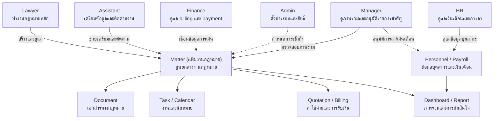

# User Roles

หน้านี้อธิบายบทบาทพื้นฐานของ MatterSolv ซึ่งเป็นชุดสิทธิ์เริ่มต้น
ไม่ใช่ชื่อตำแหน่งงานหรือแผนราคา

สมาชิกหนึ่งคนมีได้มากกว่าหนึ่งบทบาทเมื่อมีหน้าที่หลายด้าน เช่น
Partner อาจใช้ทั้ง Lawyer และ Manager
ส่วนสิทธิ์ที่มีความเสี่ยงสูงต้องกำหนดเพิ่มเติม
เป็นรายบุคคลและระบุขอบเขตให้ชัดเจน

บทบาททุกกลุ่มมีให้ใช้กับทุกแผน แต่สมาชิกจะเข้าได้เฉพาะโมดูลที่แผนของ
สำนักงานเปิดไว้

## Admin

Admin คือผู้ดูแลการตั้งค่าและความปลอดภัยของสำนักงาน ผู้ดูแล Platform ไม่ได้รับ
บทบาทนี้ในสำนักงานและต้องใช้ช่องทางช่วยเหลือที่แยกจาก
บัญชีสมาชิกปกติ

หน้าที่หลัก:

- จัดการสำนักงาน สมาชิก บทบาท และสิทธิ์รายบุคคล
- ตั้งค่า master data เช่น ประเภทแฟ้มงานกฎหมาย ประเภทเอกสาร สถานะงาน
  และข้อมูลตั้งต้นที่ระบบใช้ซ้ำ
- ตั้งค่า security เช่น MFA, password policy, RBAC และ access control
- ดู audit log และตรวจสอบการเข้าถึงข้อมูลสำคัญ
- ตั้งค่าการเชื่อมต่อระบบภายนอกตามที่ระบบรองรับ
- ตั้งค่าข้อมูลที่ใช้กับ e-signature หรือผู้อนุมัติ เมื่อมีการกำหนดขั้นตอนชัดเจน

## Lawyer

Lawyer คือผู้ทำงานกฎหมายหลัก เช่น ทนาย พนักงานกฎหมาย หรือทนายอาวุโส ที่ทำงานกับ
Matter (แฟ้มงานกฎหมาย), client, document, task และ calendar

หน้าที่หลัก:

- สร้างและดูแลแฟ้มงานกฎหมายที่ตนรับผิดชอบ
- บันทึกข้อมูลลูกความ ข้อมูลคดี/งานกฎหมาย และสถานะงาน
- สร้างเอกสารทางกฎหมายจาก template และแก้ไขร่างเอกสาร
- อัปโหลด จัดหมวดหมู่ แท็ก และเชื่อมเอกสารกับแฟ้มงานกฎหมาย
- สร้าง task นัดหมาย deadline และติดตามงานของตนเอง
- ให้ข้อมูลสำหรับ quotation หรือ service fee ตามขอบเขตบริการทางกฎหมาย
- review หรือ approve เอกสาร เฉพาะกรณีที่ได้รับ permission ระดับ senior

## Assistant

Assistant คือผู้ช่วยปฏิบัติการของทีมกฎหมาย เช่น legal assistant, case
coordinator หรือทีมงานที่ช่วยเตรียมข้อมูลและติดตามงาน

หน้าที่หลัก:

- สร้างหรืออัปเดตข้อมูลพื้นฐานของแฟ้มงานกฎหมายตามที่ได้รับมอบหมาย
- เตรียมเอกสาร อัปโหลดไฟล์ จัดหมวดหมู่ และใส่ metadata
- จัดตารางนัดหมาย ติดตาม deadline และส่ง reminder
- สร้าง task ย่อยหรืออัปเดตสถานะงานตามความคืบหน้าจริง
- ประสานงานระหว่าง lawyer, finance และ manager
- ช่วยค้นหาเอกสารหรือข้อมูลที่เกี่ยวข้องกับแฟ้มงานกฎหมาย

## Finance

Finance คือผู้ดูแลงาน quotation, billing, invoice, payment และข้อมูลการเงิน
ที่เกี่ยวข้องกับแฟ้มงานกฎหมาย

หน้าที่หลัก:

- สร้าง ตรวจสอบ หรืออัปเดต quotation ตามข้อมูลบริการและค่าธรรมเนียม
- ดูแล invoice, payment, billing status และยอดค้างชำระ
- บันทึกข้อมูลรับเงิน รายการจ่ายเงิน ภาษี และข้อมูลการเงินตั้งต้น
- ติดตามสถานะการชำระเงินและจัดทำรายงานการเงินเบื้องต้น
- ตรวจสอบ financial control เช่น expense approval หรือวงเงินเครดิต เมื่ออยู่ใน
  scope
- ประสานงานกับ lawyer และ manager เพื่อยืนยันข้อมูลค่าบริการ

## HR

HR คือผู้ดูแลงานบุคลากรของสำนักงาน เช่น เงินเดือน (Payroll) การลา
และข้อมูลพนักงาน แยกออกจาก Finance เพื่อรักษาความลับของข้อมูลเงินเดือน
ไม่ให้ปนกับข้อมูล billing ของลูกค้า

หน้าที่หลัก:

- คำนวณเงินเดือน ภาษี ประกันสังคม กองทุน OT เบี้ยขยัน และโบนัส
- ออก payslip ออนไลน์ และจัดการรอบเงินเดือน
- ดูแลระบบลาออนไลน์ (Leave Management)
  รวมถึงอนุมัติเบื้องต้นและติดตามวันลาคงเหลือ
- บันทึกและปรับปรุงข้อมูลบุคลากร เช่น ตำแหน่ง แผนก และวันเริ่มงาน
- Export ข้อมูลเงินเดือนและการลาให้ทีมบัญชีตามรอบที่กำหนด
- จัดทำรายงานสรุปด้าน HR ให้ Manager ใช้ประกอบการตัดสินใจ

## Manager

Manager คือผู้บริหาร หุ้นส่วน ทนายอาวุโส หรือ legal practice manager
ที่ต้องเห็นภาพรวมเพื่อควบคุมงาน ตัดสินใจ และอนุมัติรายการสำคัญ

หน้าที่หลัก:

- ดู dashboard ภาพรวมของแฟ้มงานกฎหมาย งานค้าง รายได้ ต้นทุน และ productivity
- ตรวจสอบ workload ของทีมและช่วยจัดลำดับความสำคัญของงาน
- approve รายการสำคัญ เช่น quotation, document, scope change หรือ expense ตาม
  policy ขององค์กร
- ดู report เพื่อประเมิน performance ของทีมและ profitability ของแต่ละแฟ้มงาน
- ติดตามความเสี่ยง เช่น deadline ใกล้ครบ งานล่าช้า หรือยอดค้างชำระสูง
- กำกับมาตรฐานการทำงานและช่วยตัดสินใจเรื่อง resource allocation

## Related Documents

- [Roles Overview](/docs/roles)
- [Permissions](/docs/roles/permissions)
