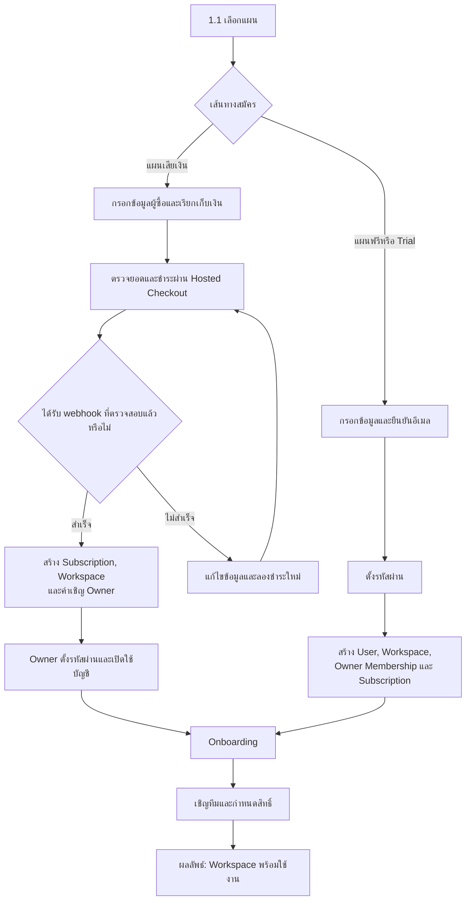
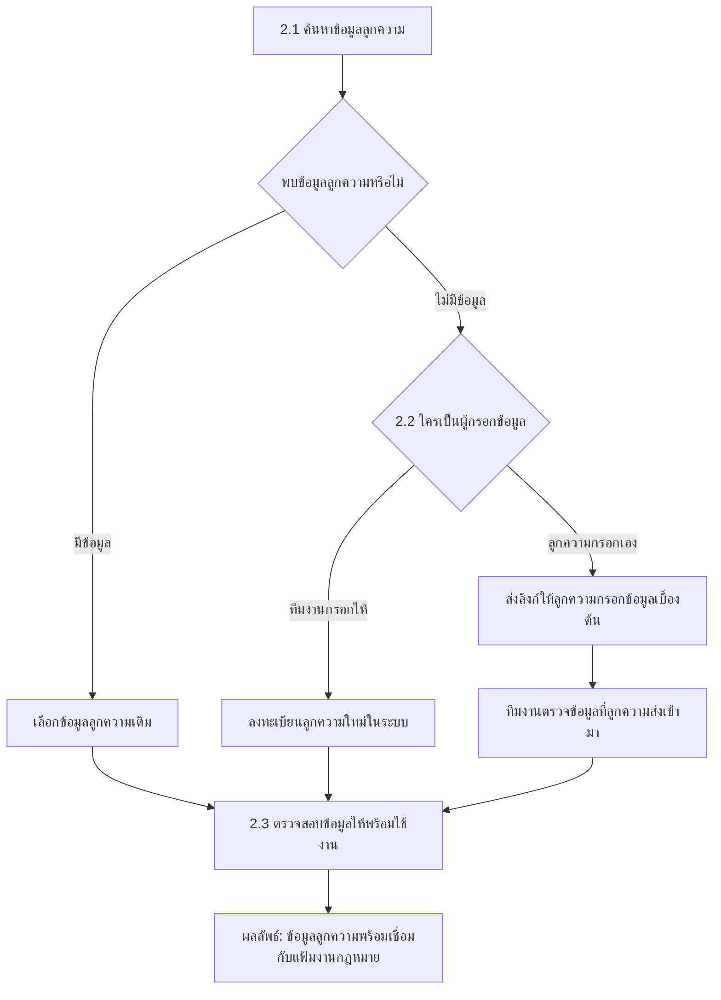
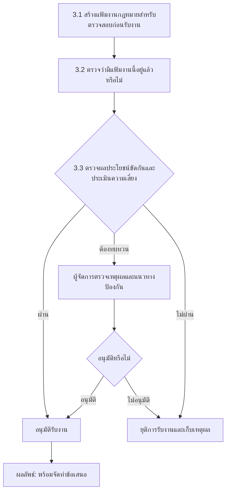
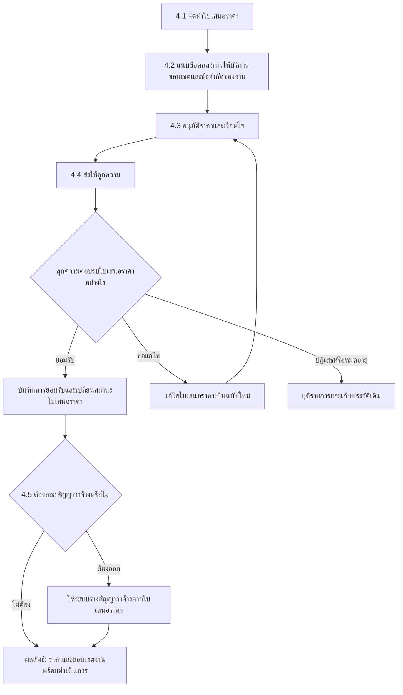
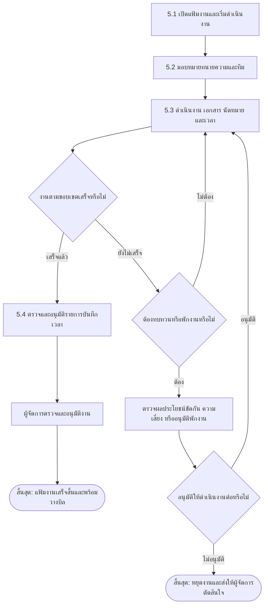
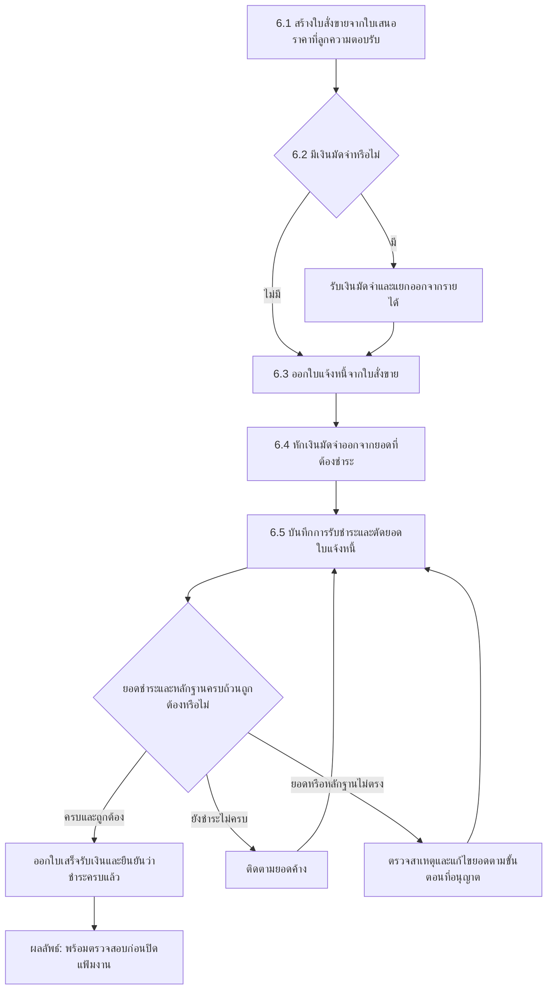
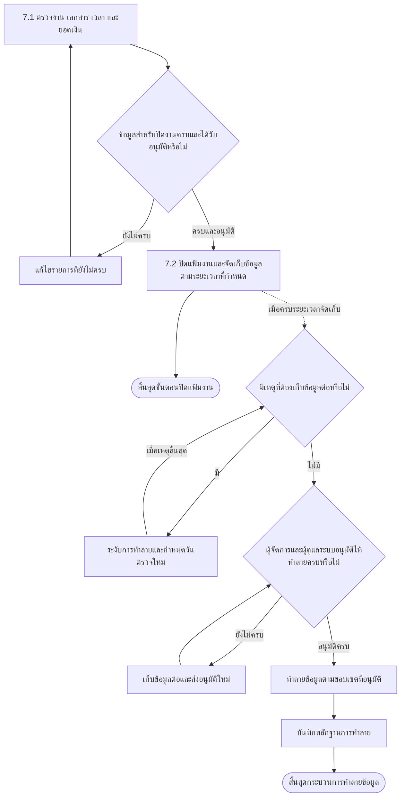

# End-to-End Legal Service Workflow

กระบวนการหลักของ MatterSolv ตั้งแต่สมัครใช้งาน สร้าง Workspace รับลูกความ
เปิดแฟ้มงานกฎหมาย ออกใบเสนอราคา ดำเนินงาน วางบิล รับชำระ และปิดแฟ้มงาน

## ภาพรวมกระบวนการ

<ol className="workflow-timeline" aria-label="ภาพรวมกระบวนการ 7 ขั้นตอน">
  <li><a href="#1-สมัครและเปิดใช้งาน"><strong>1</strong>สมัครใช้งาน</a></li>
  <li><a href="#2-จัดการลูกความ"><strong>2</strong>จัดการลูกความ</a></li>
  <li><a href="#3-ประเมินการรับงาน"><strong>3</strong>ประเมินรับงาน</a></li>
  <li><a href="#4-ตกลงราคาและขอบเขต"><strong>4</strong>เสนอราคา</a></li>
  <li><a href="#5-เปิดและดำเนินงาน"><strong>5</strong>ดำเนินงาน</a></li>
  <li><a href="#6-วางบิลและรับชำระ"><strong>6</strong>วางบิล</a></li>
  <li><a href="#7-ปิดแฟ้มงานกฎหมายและเก็บรักษาหลักฐาน"><strong>7</strong>ปิดแฟ้มงาน</a></li>
</ol>

<section className="workflow-mermaid-phase">

## 1. สมัครและเปิดใช้งาน

สร้าง Workspace ที่พร้อมให้ทีมเริ่มทำงาน

คำอธิบายขั้นตอน

1. **เลือกแผน:** ผู้สมัครเลือก STANDARD ฟรีหรือแผนเสียเงินตาม Module
   ที่ต้องการใช้
2. **กรณีแผนฟรีหรือ Trial:** ผู้สมัครกรอกข้อมูล ยืนยันอีเมล และตั้งรหัสผ่าน
   ก่อนระบบสร้าง Workspace
3. **กรณีแผนเสียเงิน:** ผู้ซื้อกรอกข้อมูลบัญชีและเรียกเก็บเงิน ตรวจยอด
   แล้วชำระผ่าน Hosted Checkout โดย MatterSolv ไม่เก็บข้อมูลบัตรดิบ
4. **ยืนยันการชำระเงิน:** ระบบสร้าง Subscription และ Workspace
   เมื่อได้รับ webhook ที่ตรวจสอบแล้ว หน้า Payment Success เพียงอย่างเดียว
   ไม่ใช่หลักฐานเปิดใช้งาน
5. **เปิดใช้ Owner:** ระบบส่งอีเมลให้ Owner ตั้งรหัสผ่านและเปิดใช้งาน User
6. **Onboarding:** Owner ยืนยันข้อมูลสำนักงานและตั้งค่าเริ่มต้น
7. **เชิญทีมและกำหนดสิทธิ์:** Owner เชิญพนักงานเข้าระบบ
   และกำหนดว่าแต่ละคนเข้า Module หรือทำรายการใดได้
8. **ผลลัพธ์:** Workspace พร้อมใช้งาน ผู้สมัครสามารถใช้งานคนเดียว
   หรือเพิ่มสมาชิกภายหลังได้

> กติกาการชำระเงิน การยืนยันการชำระ และการกำหนดสิทธิ์ของสมาชิก
> อยู่ใน [Signup, Subscription & Access](/docs/plans/subscription-access)

</section>

<section className="workflow-mermaid-phase">

## 2. จัดการลูกความ

ยืนยันข้อมูลลูกความก่อนสร้างแฟ้มงานกฎหมาย

คำอธิบายขั้นตอน

1. **ค้นหาข้อมูลลูกความ:** ค้นหาจากข้อมูลที่มี เช่น ชื่อหรือเลขอ้างอิง
   ก่อนสร้างรายการใหม่
2. **กรณีมีข้อมูล:** เลือกข้อมูลลูกความเดิมและตรวจว่าข้อมูลยังถูกต้อง
   เพื่อไม่ให้เกิดรายการซ้ำ
3. **กรณีไม่มีข้อมูล:** เลือกได้สองทาง คือทีมงานกรอกข้อมูลให้เอง
   หรือส่งลิงก์ให้ลูกความกรอกข้อมูลเบื้องต้นเข้ามาในระบบด้วยตนเอง
4. **กรณีลูกความกรอกเอง:** ทีมงานตรวจข้อมูลที่ส่งเข้ามาก่อนนำไปใช้จริง
   ข้อมูลจากลิงก์ยังไม่ถือว่าพร้อมใช้จนกว่าจะผ่านการตรวจ
5. **ตรวจสอบข้อมูล:** ตรวจว่าข้อมูลสำคัญครบถ้วน เช่น รหัสลูกความ
   เลขบัตรประชาชนหรือเลขทะเบียนนิติบุคคล และประเภทลูกความ
6. **ผลลัพธ์:** ได้ข้อมูลลูกความที่ผ่านการตรวจสอบและพร้อมเชื่อมกับแฟ้มงานกฎหมาย

</section>

<section className="workflow-mermaid-phase">

## 3. ประเมินการรับงาน

ตรวจความซ้ำซ้อน ผลประโยชน์ขัดกัน และความเสี่ยง

คำอธิบายขั้นตอน

1. **สร้างแฟ้มงานสำหรับตรวจสอบ:** บันทึกข้อมูลเบื้องต้นของงาน
   ลูกความ คู่กรณี และขอบเขตงานที่ต้องการให้ดำเนินการ
2. **ตรวจแฟ้มงานเดิม:** ตรวจว่ามีแฟ้มงานเดียวกันอยู่แล้วหรือไม่
   เพื่อไม่ให้สร้างรายการซ้ำ
3. **ตรวจผลประโยชน์ขัดกัน:** ตรวจความเกี่ยวข้องของลูกความ คู่กรณี
   และผู้ที่เกี่ยวข้องก่อนรับงาน
4. **ประเมินความเสี่ยง:** พิจารณาความเสี่ยงของงานและแนวทางป้องกัน
   ก่อนตัดสินใจ
5. **กรณีผ่าน:** อนุมัติรับงานและดำเนินการจัดทำข้อเสนอ
6. **กรณีต้องทบทวน:** ผู้จัดการตรวจเหตุผลและแนวทางป้องกัน
   แล้วตัดสินใจว่าจะรับงานหรือไม่
7. **กรณีไม่ผ่านหรือไม่อนุมัติ:** ยุติการรับงานและบันทึกเหตุผลไว้
8. **ผลลัพธ์:** งานที่ได้รับอนุมัติพร้อมเข้าสู่ขั้นตอนจัดทำข้อเสนอ

</section>

<section className="workflow-mermaid-phase">

## 4. ตกลงราคาและขอบเขต

ทำให้ราคา ขอบเขต และการยอมรับของลูกความตรวจสอบย้อนหลังได้

คำอธิบายขั้นตอน

1. **จัดทำใบเสนอราคา:** ระบุประเภทบริการและรูปแบบค่าบริการ ทั้งแบบรายชั่วโมง
   เหมาจ่าย หรือแบ่งตามงวดงาน พร้อมเงื่อนไขการชำระ ส่วนลด
   และค่าธรรมเนียมพิเศษกรณีงานเร่งด่วน
2. **แนบเอกสารประกอบ:** แนบข้อตกลงการให้บริการไปกับใบเสนอราคา
   และระบุขอบเขตกับข้อจำกัดของงานไว้ท้ายเอกสารเพื่อป้องกันข้อโต้แย้งภายหลัง
3. **อนุมัติราคาและเงื่อนไข:** ใบเสนอราคา**ต้องผ่านการอนุมัติก่อนส่งให้ลูกความ
   ทุกครั้ง** ไม่มีกรณียกเว้น
4. **ส่งให้ลูกความ:** ส่งผ่านอีเมลจากในระบบ ให้ลูกความพิจารณาราคา ขอบเขตงาน
   และเงื่อนไข
5. **กรณียอมรับ:** เมื่อลูกความยืนยันกลับมา ผู้ดูแลเป็นผู้เปลี่ยนสถานะ
   ใบเสนอราคาในระบบ ระบบไม่เปลี่ยนสถานะเองอัตโนมัติ
6. **กรณีขอแก้ไข:** จัดทำใบเสนอราคาฉบับใหม่และส่งอนุมัติอีกครั้ง
7. **กรณีปฏิเสธหรือหมดอายุ:** ยุติใบเสนอราคาและเก็บประวัติเดิมไว้
8. **ออกสัญญาว่าจ้าง:** ใบเสนอราคาที่อนุมัติและลูกความตอบรับแล้ว
   สามารถเลือกให้ระบบร่างสัญญาว่าจ้างต่อได้ทันที
9. **ผลลัพธ์:** ราคาและขอบเขตงานได้รับการยืนยัน พร้อมเริ่มดำเนินงาน

</section>

<section className="workflow-mermaid-phase">

## 5. เปิดและดำเนินงาน

ใช้แฟ้มงานกฎหมายเป็นศูนย์กลางของทีม งาน นัดหมาย เอกสาร และเวลา

คำอธิบายขั้นตอน

1. **เปิดแฟ้มงาน:** เริ่มงานตามราคาและขอบเขตที่ลูกความยอมรับแล้ว
2. **มอบหมายทีม:** กำหนดทนายความและผู้ร่วมงานที่รับผิดชอบ
   หากมอบหมายในช่วงที่ทนายไม่ว่าง ระบบจะแจ้งเตือน แต่ยังยืนยันมอบหมายได้
3. **ดำเนินงาน:** บันทึกงาน เอกสาร นัดหมาย และเวลาทำงานไว้ในแฟ้มเดียวกัน
   โดยบันทึกเวลาได้ทั้งแบบจับเวลาและกรอกย้อนหลัง พร้อมระบุว่าเป็นงานที่
   เรียกเก็บเงินได้หรือไม่
4. **ตรวจความคืบหน้า:** พิจารณาว่างานตามขอบเขตเสร็จแล้วหรือยัง
5. **ตรวจและอนุมัติรายการบันทึกเวลา:** ผู้มีอำนาจตรวจและอนุมัติเวลาที่ทีมบันทึก
   ก่อนนำไปเรียกเก็บเงิน เพราะมีผลโดยตรงต่อยอดที่เรียกเก็บจากลูกความ
6. **กรณีงานเสร็จ:** ผู้จัดการตรวจและอนุมัติก่อนส่งไปวางบิล
7. **กรณียังไม่เสร็จ:** ดำเนินงานต่อ หรือส่งทบทวนเมื่อมีเหตุให้พักงาน
8. **กรณีต้องทบทวน:** ตรวจผลประโยชน์ขัดกันและความเสี่ยงอีกครั้ง
   ก่อนตัดสินใจว่าจะทำงานต่อหรือหยุดงาน
9. **ผลลัพธ์:** แฟ้มงานเสร็จพร้อมวางบิล หรือหยุดงานตามคำตัดสินของผู้จัดการ

> **กฎการบันทึกเวลา:** ระบบปัดเวลาทำงานเป็นขั้นต่ำครั้งละ 15 นาที เช่น
> 1 ชั่วโมง 8 นาที คิดเป็น 1 ชั่วโมง 15 นาที และ 1 ชั่วโมง 16 นาที
> คิดเป็น 1 ชั่วโมง 30 นาที เมื่อรายการบันทึกเวลาได้รับอนุมัติหรือ
> ถูกเรียกเก็บเงินไปแล้ว จะแก้ไขไม่ได้อีก และการแก้ไขทุกครั้งจะแจ้งเตือน
> ผู้เกี่ยวข้องทันที

</section>

<section className="workflow-mermaid-phase">

## 6. วางบิลและรับชำระ

ออกใบแจ้งหนี้ รับเงิน และยืนยันยอดก่อนส่งปิดแฟ้มงาน

คำอธิบายขั้นตอน

1. **สร้างใบสั่งขาย:** แปลงใบเสนอราคาที่ลูกความตอบรับแล้วเป็นใบสั่งขาย
   ซึ่งเป็นรายการที่ใช้ติดตามบริการและการชำระเงินของงานนั้น
2. **ตรวจเงื่อนไขเงินมัดจำ:** หากตกลงให้มีเงินมัดจำ ให้รับเงินและบันทึกแยก
   ออกจากรายได้จนกว่าจะมีการใช้จริง
3. **ออกใบแจ้งหนี้:** ออกจากใบสั่งขาย โดยหนึ่งใบสั่งขายออกใบแจ้งหนี้ได้หลายฉบับ
   ตามงวดที่ตกลงกัน
4. **หักเงินมัดจำ:** นำเงินมัดจำที่รับไว้มาลดยอดที่ลูกความต้องชำระ
5. **บันทึกการรับชำระ:** ระบุว่าเงินที่ได้รับนำไปชำระใบแจ้งหนี้ใด
6. **ตรวจยอดและหลักฐาน:** เปรียบเทียบจำนวนเงินกับหลักฐานการชำระ
7. **กรณีชำระครบ:** ออกใบกำกับภาษีหรือใบเสร็จรับเงิน
   และยืนยันว่ารับเงินครบแล้ว
8. **กรณียังชำระไม่ครบ:** ติดตามยอดค้างและบันทึกการชำระเพิ่มเติม
9. **กรณีข้อมูลไม่ตรง:** ตรวจหาสาเหตุ แก้ไขตามขั้นตอน และตรวจใหม่
10. **ผลลัพธ์:** ยอดเงินได้รับการยืนยัน พร้อมเข้าสู่การตรวจสอบก่อนปิดแฟ้มงาน

> **ลำดับเอกสาร:** ใบเสนอราคา → ใบสั่งขาย → เงินมัดจำ (ถ้ามี) → ใบแจ้งหนี้ →
> การรับชำระ → ใบเสร็จรับเงิน ส่วนการจ่ายค่าใช้จ่ายของสำนักงานเป็นสายงานแยก
> ไม่อยู่ในลำดับนี้

</section>

<section className="workflow-mermaid-phase">

## 7. ปิดแฟ้มงานกฎหมายและเก็บรักษาหลักฐาน

ตรวจความครบถ้วนก่อนจำกัดการทำรายการและเริ่มระยะเวลาจัดเก็บข้อมูล

> **หมายเหตุ:** การปิดแฟ้มงานไม่ทำลายข้อมูลทันที การทำลายจะเริ่มได้เมื่อครบ
> ระยะเวลาจัดเก็บ ไม่มีเหตุที่ต้องเก็บต่อ และได้รับอนุมัติครบตามที่กำหนด
> ผู้อนุมัติและผู้ดำเนินการทำลายต้องเป็นคนละบัญชี

คำอธิบายขั้นตอน

1. **ตรวจความครบถ้วน:** ตรวจงาน เอกสาร เวลาทำงาน และยอดเงิน
   ก่อนปิดแฟ้มงาน
2. **กรณีข้อมูลยังไม่ครบ:** แก้ไขรายการที่ขาดและส่งตรวจใหม่
3. **กรณีข้อมูลครบ:** ปิดแฟ้มงานและเริ่มนับระยะเวลาจัดเก็บข้อมูล
4. **หลังปิดแฟ้มงาน:** ระบบเก็บข้อมูลไว้ตามระยะเวลาที่กำหนด
   โดยยังไม่ทำลายข้อมูลทันที
5. **เมื่อครบระยะเวลาจัดเก็บ:** ตรวจว่ามีคดี คำสั่ง หรือเหตุอื่น
   ที่ต้องเก็บข้อมูลต่อหรือไม่
6. **กรณีต้องเก็บต่อ:** ระงับการทำลายและกำหนดวันตรวจสอบใหม่
7. **กรณีไม่ต้องเก็บต่อ:** ขออนุมัติจากผู้จัดการและผู้ดูแลระบบ
8. **เมื่ออนุมัติครบ:** ผู้ดำเนินการที่ไม่ใช่ผู้อนุมัติ
   ทำลายเฉพาะข้อมูลที่ได้รับอนุมัติ
9. **บันทึกหลักฐาน:** เก็บข้อมูลว่าใครอนุมัติ ใครดำเนินการ
   ทำลายอะไร และทำเมื่อใด

</section>

